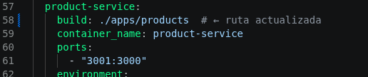
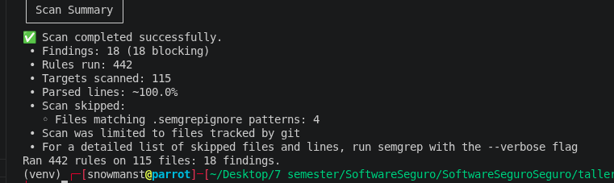
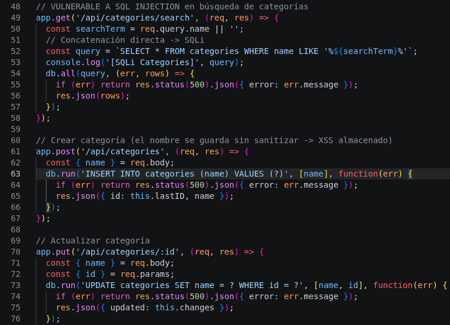
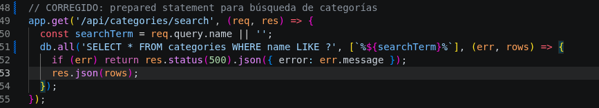
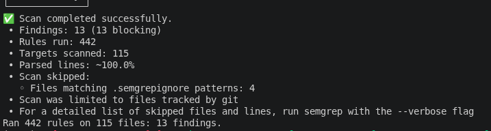

# Sebastian Parra

Para la ejecucion del proeycto, en el docker compose habia problemas, uno de ellos fue un build, que llamaba a una carpeta inexistente llamada products-service, se la cambio por products y otro eeror fueron las versiones de Node, se necesitaba una version mayor a la 20.x.x pero el Dockerfile estaba trayendo una version 18, lo cual no usa Vite

Luego continuamos con el escaneo de vulnerabilidades y salieron 18

Una de esas vulnerabildiades es lad e SQLInjection en la que un atacante podria escribir ' OR '1'='1 para extraer toda la tabla, en este caso corresponde a A03:2021 - Injection del OWASP Top 10 en donde el mas clasico es SQL Injection

Despues de reliazar las correcciones en los archivos .... corrigiendo los ....... se pudieron observar que ya no hay esas vulnerabildiades 

Paso de 18 vulnerabildiades a 13 vulnerabildiades

