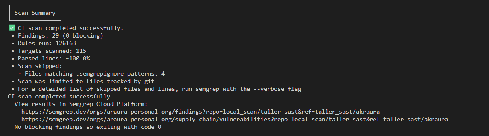
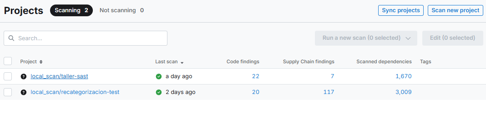
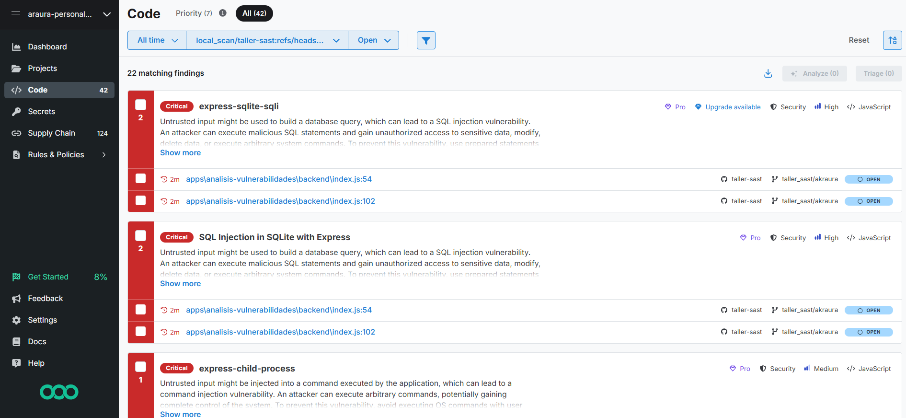
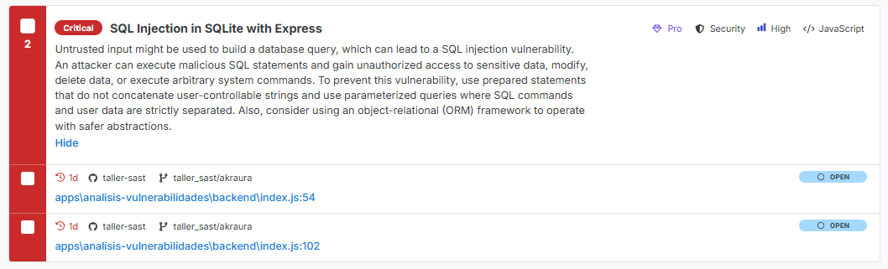
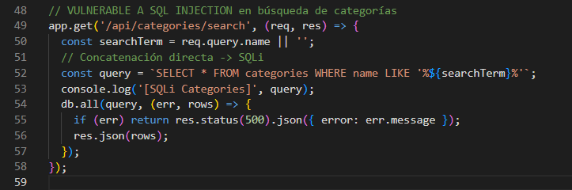
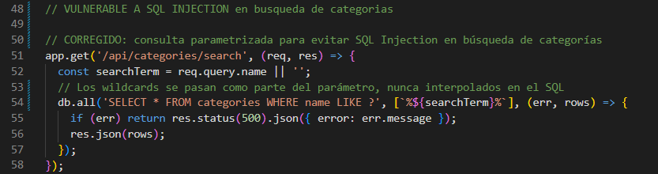
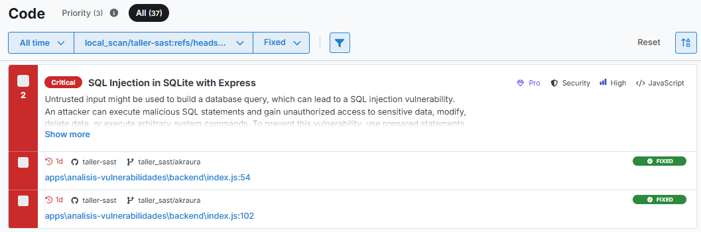
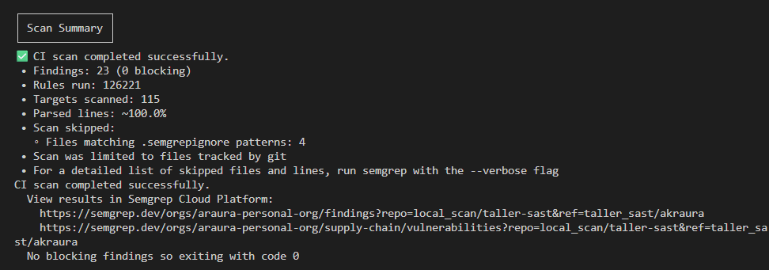
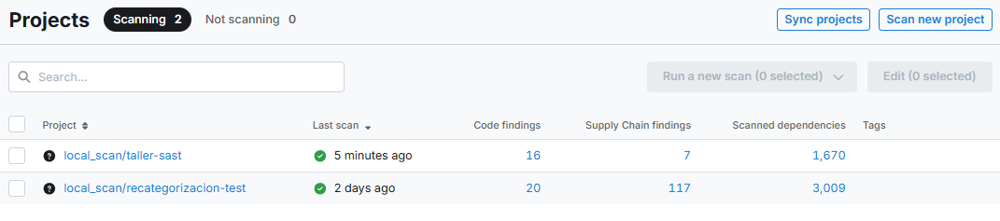

# TALLER EN CLASE - ANDREA RAURA

---

## Errores corregidos antes de levantar el proyecto

### 1. Ruta incorrecta del product-service en docker-compose

**Error:** El campo `build` del servicio `product-service` en `docker-compose.yml` apuntaba a una ruta incorrecta que no correspondía a la ubicación real del microservicio dentro del monorepo.

**Solución:** Se corrigió la ruta de construcción para que apunte a `./apps/products`, que es donde se encuentra el código fuente del servicio de productos.

```yaml
# Antes
build: ./apps/product-service

# Después
build: ./apps/products
```

---

### 2. Importación no utilizada: `refresh as ApiRefresh` en AuthContext

**Error:** En el contexto de autenticación del frontend (`AuthContext`), se importaba `refresh as ApiRefresh` desde el módulo de API, pero nunca se usaba en el código. Esto generaba una advertencia de TypeScript/ESLint por importación no utilizada.

**Solución:** Se eliminó la importación `ApiRefresh` del archivo de contexto de autenticación, manteniendo únicamente las importaciones que sí se usan.

---

### 3. Incompatibilidad de versión de Node en los Dockerfiles

**Error:** Los archivos `Dockerfile` de `auth-service` y `products` usaban `node:18-alpine` como imagen base. Esta versión causaba incompatibilidades con algunas dependencias del proyecto que requieren Node 20+.

**Solución:** Se actualizó la imagen base en ambas etapas (build y producción) de los Dockerfiles a `node:20-alpine`.

```dockerfile
# Antes
FROM node:18-alpine AS build
FROM node:18-alpine

# Después
FROM node:20-alpine AS build
FROM node:20-alpine
```

Archivos modificados:
- `apps/auth-service/Dockerfile`
- `apps/products/Dockerfile`

---

### 4. Conflicto de puertos entre auth-service y product-service

**Error:** Ambos servicios estaban configurados para exponer el mismo puerto del host en `docker-compose.yml`, lo que provocaba un conflicto al intentar levantar los contenedores simultáneamente.

**Solución:** Se asignaron puertos distintos del host a cada servicio, manteniendo el puerto interno del contenedor en 3000.

```yaml
# auth-service
ports:
  - "3000:3000"

# product-service
ports:
  - "3001:3000"
```

---

### 5. CORS bloqueando las peticiones del frontend

**Error:** Había tres problemas relacionados con CORS:

**5a.** El origen permitido en ambos servicios tenía como fallback `http://localhost:3000`, pero el frontend corre en `http://localhost` (puerto 80). Al ser orígenes distintos, el navegador bloqueaba todas las peticiones preflight.

**5b.** La variable de entorno `ALLOWED_ORIGINS` no estaba definida en `docker-compose.yml` para ningún servicio, por lo que siempre se usaba el fallback incorrecto.

**5c.** En `auth-service/src/main.ts`, el campo `methods` tenía todos los métodos en un único string en lugar de un array de strings separados, lo que hacía fallar las peticiones OPTIONS.

**Solución:**

Se agregó `ALLOWED_ORIGINS: http://localhost` en el bloque `environment` de `auth-service` y `product-service` en `docker-compose.yml`:

```yaml
environment:
  ALLOWED_ORIGINS: http://localhost
```

Se corrigió el formato de `methods` en `apps/auth-service/src/main.ts`:

```typescript
// Antes
methods: ['GET,PUT,POST,DELETE'],

// Después
methods: ['GET', 'PUT', 'POST', 'DELETE'],
```

Se actualizó el fallback de origin en `apps/products/src/main.ts`:

```typescript
// Antes
origin: process.env.ALLOWED_ORIGINS?.split(',') || ['http://localhost:3000'],

// Después
origin: process.env.ALLOWED_ORIGINS?.split(',') || ['http://localhost'],
```

---

### 6. Ruta incorrecta en el controlador de productos

**Error:** El decorador `@Controller` en `apps/products/src/product/product.controller.ts` registraba la ruta como `product` (singular), pero el frontend hacía todas sus peticiones a `/products` (plural). Esto causaba un error **404 Not Found** en todos los endpoints del servicio de productos.

Adicionalmente, el decorador `@Post()` estaba duplicado en el método `create`.

**Solución:** Se corrigió el nombre de la ruta en el decorador y se eliminó el `@Post()` duplicado.

```typescript
// Antes
@Controller('product')

// Después
@Controller('products')
```

---

## Correcciones en product.service.ts y product.controller.ts

### 7. product.service.ts solo retornaba strings de prueba

**Error:** El archivo `apps/products/src/product/product.service.ts` fue generado con el scaffolding de NestJS y nunca se implementó. Todos sus métodos retornaban strings literales en lugar de interactuar con la base de datos.

```typescript
// Estado inicial (sin funcionalidad real)
create(createProductDto: CreateProductDto) {
  return 'This action adds a new product';
}
findAll() {
  return `This action returns all product`;
}
```

**Solución:** Se implementaron todos los métodos con TypeORM. Los cambios principales fueron:

- Se inyectó `Repository<Product>` con `@InjectRepository` y `CategoryService` para resolver la relación de categoría.
- `create`: verifica nombre duplicado, resuelve la categoría por UUID y persiste el producto.
- `findAll`: usa `QueryBuilder` para soportar filtros opcionales por `categoryId`, `search` (nombre), `minPrice` y `maxPrice`, y solo retorna productos activos (`isActive = true`).
- `findOne`: busca por UUID string con la relación `category` cargada; lanza `NotFoundException` si no existe.
- `update`: carga el producto existente, actualiza la categoría solo si se envía `categoryId`, aplica los demás campos con `Object.assign` y guarda.
- `remove`: carga el producto y lo elimina con `repository.remove`.

---

### 8. product.controller.ts usaba tipos y decoradores incorrectos

**Error:** El controlador tenía tres problemas que impedían el correcto funcionamiento:

**8a. `@Patch` en lugar de `@Put`:** El frontend envía `PUT` para actualizar productos (`method: 'PUT'` en `api/products.ts`), pero el controlador registraba el endpoint como `PATCH`. Esto causaba un **404** en cada intento de actualización.

```typescript
// Antes
@Patch(':id')
update(...) { ... }

// Después
@Put(':id')
update(...) { ... }
```

**8b. Conversión numérica `+id` en un campo UUID:** Los métodos `findOne`, `update` y `remove` convertían el `id` a número con `+id`, pero la entidad `Product` usa `@PrimaryGeneratedColumn('uuid')` — el identificador es un `string` UUID. Convertir un UUID a número produce `NaN`, lo que hacía que todas esas operaciones fallaran silenciosamente.

```typescript
// Antes
findOne(@Param('id') id: string) {
  return this.productService.findOne(+id);  // NaN
}

// Después
findOne(@Param('id') id: string) {
  return this.productService.findOne(id);   // UUID string
}
```

**8c. `findAll` no recibía los parámetros de filtro:** El método `findAll` no tenía el decorador `@Query()` ni el DTO `QueryProductDto`, por lo que los parámetros de búsqueda enviados desde el frontend (`?search=...`, `?categoryId=...`, etc.) eran ignorados.

```typescript
// Antes
@Get()
findAll() {
  return this.productService.findAll();
}

// Después
@Get()
findAll(@Query() query: QueryProductDto) {
  return this.productService.findAll(query);
}
```

Además se eliminó el decorador `@Post()` duplicado que existía en el método `create`, y se reemplazó la importación de `Patch` por `Put` y se agregó `Query` en los imports de `@nestjs/common`.

---

## Escaneo con Semgrep

### Resultados del escaneo inicial 




#### Vulnerabilidades encontradas



### Vulnerabilidad a corregir: SQL Injection en endpoints de búsqueda (CWE-89)




**Archivo afectado:** `apps/analisis-vulnerabilidades/backend/index.js`

**Descripción de la vulnerabilidad:**

Dos endpoints de búsqueda construían la consulta SQL concatenando directamente el valor del parámetro de entrada `req.query.name` dentro del string SQL, sin ningún tipo de validación ni escape. Esto permite que un atacante inyecte SQL arbitrario y manipule la consulta, pudiendo leer, modificar o eliminar datos de la base de datos.

| Endpoint vulnerable | Línea (antes del fix) |
|---|---|
| `GET /api/categories/search` | 52-54 |
| `GET /api/products/search` | 100-102 |


### Vulnerabilidad corregida
**Solución aplicada: consultas parametrizadas**

Se reemplazó la concatenación de strings por consultas parametrizadas usando el placeholder `?` de `sqlite3`. Los wildcards (`%`) se incluyen en el valor del parámetro, no en el SQL, de modo que el driver trata el valor de entrada como dato puro, nunca como parte de la sintaxis SQL.

```javascript
// CORREGIDO: el input se pasa como parámetro separado del SQL
const searchTerm = req.query.name || '';
db.all('SELECT * FROM categories WHERE name LIKE ?', [`%${searchTerm}%`], (err, rows) => { ... });
```



---

### Escaneo final





