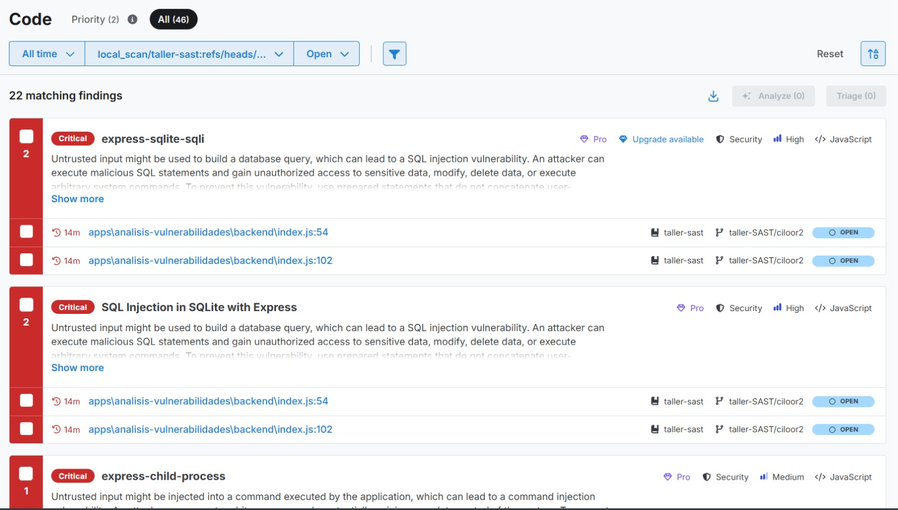
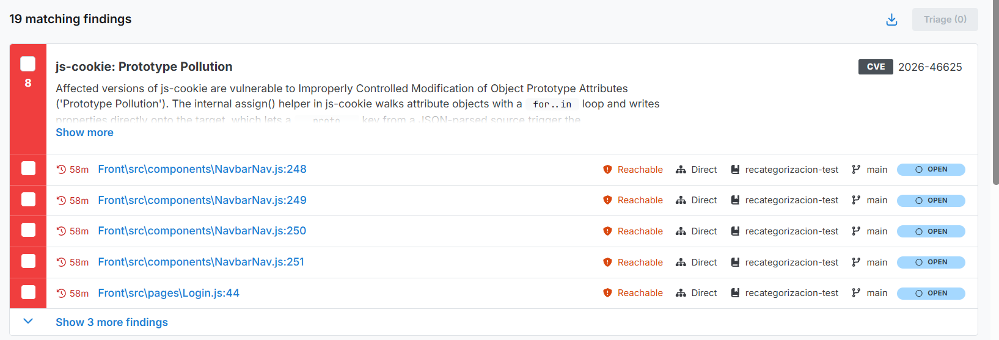

# Solución - Corrección de Vulnerabilidades y Análisis Estático



## 1. Corrección de `docker-compose.yml`

**Problema:** Secretos hardcodeados (JWT_SECRET, POSTGRES_PASSWORD) expuestos en el archivo docker-compose.yml.

**Solución:** Reemplazar valores estáticos por variables de entorno con valores por defecto usando sintaxis `${VARIABLE:-default}`. Ahora los secretos se configuran mediante un archivo `.env`.

**Cambios realizados:**
- `POSTGRES_PASSWORD: postgres` → `POSTGRES_PASSWORD: ${POSTGRES_PASSWORD:-postgres}`
- `JWT_SECRET: ClaveSecretaMuySeguraCambiarEnProduccion` → `JWT_SECRET: ${JWT_SECRET:-ClaveSecretaMuySeguraCambiarEnProduccion}`
- `ALLOWED_ORIGINS` ahora se pasa a los servicios de autenticación y productos
- Se agregó `PORT: 3000` al auth-service para que escuche en el puerto correcto
- Se creó `.env` en la raíz para centralizar variables de entorno

## 2. Corrección de CORS - `auth-service/src/main.ts`

**Problema:** Typo en origen CORS por defecto: `http:localhost:3000` (faltaban las barras `//`).

**Solución:**
```diff
- origin: process.env.ALLOWED_ORIGINS?.split(',') || ['http:localhost:3000'],
+ origin: process.env.ALLOWED_ORIGINS?.split(',') || ['http://localhost:3000'],
```

## 3. Análisis de Vulnerabilidades - `apps/analisis-vulnerabilidades`

### 3.1 Command Injection (CRÍTICO)

**Problema:** Endpoint `/api/exec` que ejecutaba cualquier comando del sistema sin restricción.

**Archivo:** `backend/index.js`

**Solución:** Se eliminó el endpoint `/api/exec` y la importación de `child_process.exec`. En el frontend se deshabilitó la pestaña de Command Injection.

### 3.2 XSS Almacenado (CRÍTICO)

**Problema:** Los nombres de categorías y productos se renderizaban con `innerHTML` sin sanitizar, permitiendo inyección de HTML/JavaScript.

**Archivo:** `frontend/script.js`

**Solución:** Se reemplazó `innerHTML` por creación segura de elementos DOM con `textContent`:
```javascript
// Antes (vulnerable):
div.innerHTML = `<span>${cat.name}</span>...`;

// Después (seguro):
const span = document.createElement('span');
span.textContent = cat.name;
div.appendChild(span);
```

### 3.3 CORS Wildcard (MEDIO)

**Problema:** `app.use(cors({ origin: '*' }))` permitía cualquier origen.

**Solución:** Se implementó una lista blanca de orígenes permitidos.

### 3.4 Nombre de paquete

**Problema:** El `package.json` tenía `name: "analisisvulnerabilidades"` pero el workspace raíz lo referenciaba como `AnalisisVulnerabilidades`.

**Solución:** Se corrigió el nombre para que coincida y se agregó el script `start:dev`.

## 4. Product Service - Corrección de Ruta y Stub

**Problema 1:** El controlador usaba `@Controller('product')` (singular) pero el frontend llamaba a `/products` (plural). Además había un decorador `@Post()` duplicado.

**Archivo:** `apps/products/src/product/product.controller.ts`

**Solución:**
```diff
- @Controller('product')
+ @Controller('products')
- @Post()
- @Post()
+ @Post()
```

**Problema 2:** El servicio de productos era un stub que devolvía strings placeholder en lugar de datos reales de la BD.

**Archivo:** `apps/products/src/product/product.service.ts`

**Solución:** Se implementó el servicio completo con TypeORM:
```typescript
@Injectable()
export class ProductService {
  constructor(
    @InjectRepository(Product)
    private readonly productRepository: Repository<Product>,
  ) {}

  async create(dto: CreateProductDto): Promise<Product> {
    const product = this.productRepository.create(dto);
    return this.productRepository.save(product);
  }

  async findAll(): Promise<Product[]> {
    return this.productRepository.find({ relations: { category: true } });
  }

  async findOne(id: string): Promise<Product> {
    const product = await this.productRepository.findOne({
      where: { id },
      relations: { category: true },
    });
    if (!product) throw new NotFoundException('Product not found');
    return product;
  }

  async update(id: string, dto: UpdateProductDto): Promise<Product> {
    const product = await this.findOne(id);
    Object.assign(product, dto);
    return this.productRepository.save(product);
  }

  async remove(id: string): Promise<void> {
    const product = await this.findOne(id);
    await this.productRepository.remove(product);
  }
}
```

**Problema 3:** El controlador usaba `@Patch` pero el frontend enviaba `PUT`.

**Solución:**
```diff
- @Patch(':id')
+ @Put(':id')
```

**Problema 4:** El controlador convertía el ID a número (`+id`) pero la entidad usa UUID (string).

**Solución:**
```diff
- return this.productService.findOne(+id);
+ return this.productService.findOne(id);
```

## 5. AuthContext - Import no usado

**Problema:** TypeScript error: `'apiRefresh' is declared but its value is never read`.

**Archivo:** `apps/frontend/src/contexts/AuthContext.tsx`

**Solución:** Se eliminó `refresh as apiRefresh` del import:
```diff
- import { login as apiLogin, register as apiRegister, refresh as apiRefresh } from '../api/auth';
+ import { login as apiLogin, register as apiRegister } from '../api/auth';
```

## 6. Product Service - Sintaxis `relations` de TypeORM

**Problema:** TypeORM v1 requiere objeto en vez de array para `relations`:
```
Type 'string[]' has no properties in common with type 'FindOptionsRelations<Product>'
```

**Archivo:** `apps/products/src/product/product.service.ts`

**Solución:**
```diff
- return this.productRepository.find({ relations: ['category'] });
+ return this.productRepository.find({ relations: { category: true } });
```

## 7. Frontend - URLs de API configurables

**Problema:** Las URLs base (`localhost:3000` y `localhost:3001`) estaban hardcodeadas, complicando el despliegue en Docker.

**Archivo:** `apps/frontend/src/api/api.ts`

**Solución:** Se usaron variables de entorno de Vite (`import.meta.env.VITE_AUTH_URL`, `import.meta.env.VITE_PRODUCT_URL`) con valores por defecto. En el `Dockerfile` se agregaron `ARG` para permitir configuración en build.

## 8. .gitignore

**Problema:** No existía `.gitignore`, por lo que archivos como `.env`, `node_modules/`, `dist/` e imágenes se rastreaban en git.

**Solución:** Se creó `.gitignore` en la raíz:
```gitignore
node_modules/
dist/
.env
*.log
.DS_Store
*.jpg
*.png
*.jpeg
```

## 9. Dockerfiles - Actualización a Node 22

**Problema:** Los Dockerfiles de `auth-service`, `product-service` y `frontend` usaban `node:18-alpine`. Vite 8 requiere Node 20+ y `@nestjs/typeorm` v11 usa `crypto.randomUUID()` como global (disponible desde Node 19+).

**Solución:** Actualizar todos los Dockerfiles a `node:22-alpine`.

**Archivos:**
- `apps/auth-service/Dockerfile`
- `apps/products/Dockerfile`
- `apps/frontend/Dockerfile`

```diff
- FROM node:18-alpine
+ FROM node:22-alpine
```

## 10. Frontend Nginx - Resolución dinámica de hostnames

**Problema:** Nginx fallaba al iniciar porque no podía resolver los hostnames `auth-service` y `product-service` (los contenedores aún no estaban listos).

**Archivo:** `apps/frontend/nginx.conf`

**Solución:** Se agregó `resolver 127.0.0.11` (DNS de Docker) y se usaron variables en `proxy_pass` para resolución dinámica:

```nginx
resolver 127.0.0.11 valid=10s ipv6=off;

location /api/auth/ {
    set $upstream_auth auth-service:3000;
    proxy_pass http://$upstream_auth;
    ...
}
```

## 11. Cómo levantar la aplicación

```bash
# En WSL Ubuntu (donde está Docker):
cd taller-sast

# Construir y levantar
docker-compose up --build -d

# Verificar estado
docker-compose ps

# Ejecutar seed de usuarios
docker-compose exec auth-service node dist/seeds/seed.js
```

Acceder a:
- Frontend: http://localhost
- Auth Service API: http://localhost:3000
- Product Service API: http://localhost:3001
- Análisis Vulnerabilidades: http://localhost:3002



Credenciales de prueba:
| Rol | Email | Contraseña |
|-----|-------|------------|
| Operador | admin@example.com | Admin12345 |
| Cliente | cliente@example.com | Cliente123 |
