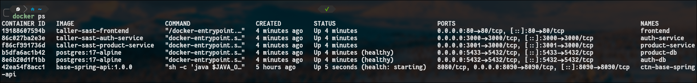
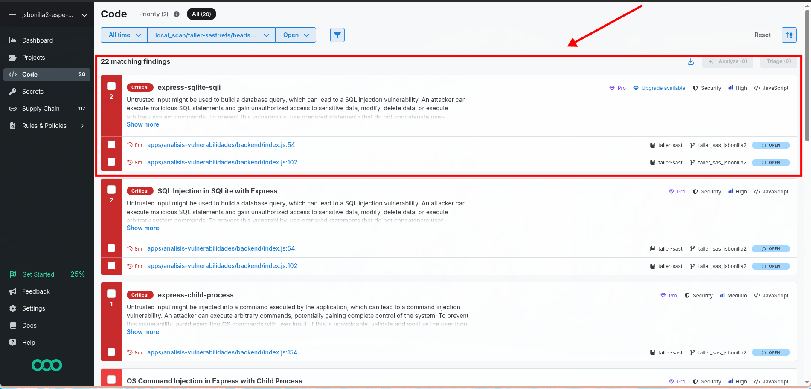
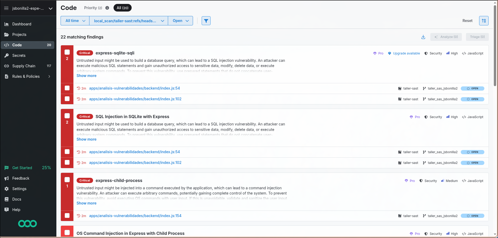
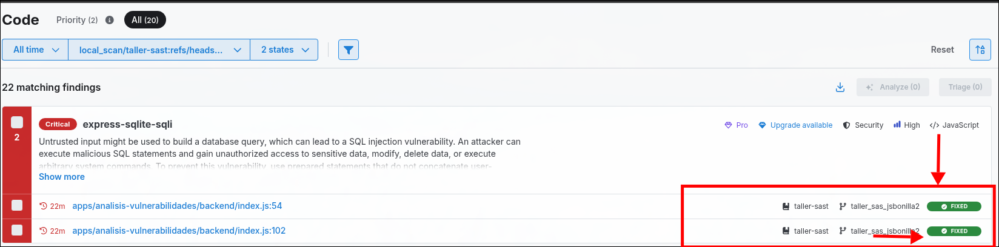
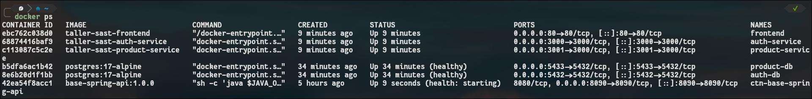

# Informe de Correcciones - Jairo Bonilla

**Autor:** Jairo Bonilla  
**Institución:** Universidad de las Fuerzas Armadas - ESPE  
**Proyecto:** Taller SAST - Análisis de vulnerabilidades

---

## Captura 1 — Corrección de funcionamiento de la aplicación

Se corrigieron los errores que impedían levantar correctamente la aplicación con Docker Compose.

### docker-compose.yml
- Se corrigió la ruta del build context de `product-service`: apuntaba a `./apps/product-service`, se cambió a `./apps/products`.

### Dockerfiles
- Se actualizó la imagen base de `node:18-alpine` a `node:22-alpine` en los tres Dockerfiles:
  - `apps/auth-service/Dockerfile`
  - `apps/products/Dockerfile`
  - `apps/frontend/Dockerfile`
- **Motivo:** NestJS 11 y Vite 8 requieren Node.js >= 20. La versión 18 generaba errores de compilación.

### Frontend
- Se eliminó el import no utilizado `apiRefresh` en `src/contexts/AuthContext.tsx` para resolver el error de compilación TS6133.

Luego de estos cambios, se ejecutó `docker compose up -d --build` y los 5 contenedores quedaron en estado healthy:

| Contenedor      | Estado    | Puerto     |
|-----------------|-----------|------------|
| auth-db         | healthy   | 5432       |
| product-db      | healthy   | 5433       |
| auth-service    | up        | 3000       |
| product-service | up        | 3001       |
| frontend        | up        | 80         |



---

## Captura 2 — Ejecución de semgrep ci

Se ejecutó el comando `semgrep ci` para analizar las vulnerabilidades del proyecto. El escaneo arrojó **29 hallazgos**, entre ellos:

- **4 Supply Chain findings** (js-yaml, multer)
- **3 Unreachable Supply Chain findings** (multer, form-data)
- **22 Code findings**, entre los que destacaban:
  - 4 vulnerabilidades de **SQL Injection** (`express-sqlite-sqli`) en `apps/analisis-vulnerabilidades/backend/index.js`
  - Command injection
  - XSS
  - CSRF
  - CORS permisivo
  - Falta de `USER` no-root en Dockerfiles



---

## Captura 3 — Corrección de vulnerabilidad SQL Injection

Se identificaron las rutas vulnerables a SQL Injection en el archivo `apps/analisis-vulnerabilidades/backend/index.js`:

**Ruta `/api/categories/search` (línea 52):**
```javascript
//  Antes (vulnerable)
const query = `SELECT * FROM categories WHERE name LIKE '%${searchTerm}%'`;
db.all(query, ...);

//  Después (corregido)
const query = `SELECT * FROM categories WHERE name LIKE ?`;
db.all(query, [`%${searchTerm}%`], ...);
```

**Ruta `/api/products/search` (línea 100):**
```javascript
//  Antes (vulnerable)
const query = `SELECT * FROM products WHERE name LIKE '%${searchTerm}%'`;
db.all(query, ...);

//  Después (corregido)
const query = `SELECT * FROM products WHERE name LIKE ?`;
db.all(query, [`%${searchTerm}%`], ...);
```

La corrección consistió en reemplazar la concatenación directa de cadenas por **parameterized queries** (consultas parametrizadas), donde el valor ingresado por el usuario se pasa como parámetro separado de la sentencia SQL. Esto evita que un atacante pueda inyectar comandos SQL maliciosos a través del parámetro `name`.



---

## Captura 4 — Verificación de la corrección

Se ejecutó nuevamente `semgrep ci` para confirmar que las vulnerabilidades de SQL Injection fueron mitigadas correctamente.

Las 4 reglas que antes reportaban las vulnerabilidades (`express-sqlite-sqli` y `sqlite-express`) ahora aparecen con la etiqueta **fixed** en verde, indicando que el código ya no es vulnerable.



Además, se verificó que la aplicación sigue funcionando correctamente reconstruyendo y levantando los contenedores con `docker compose up -d --build`, confirmando que todos los servicios están saludables.


