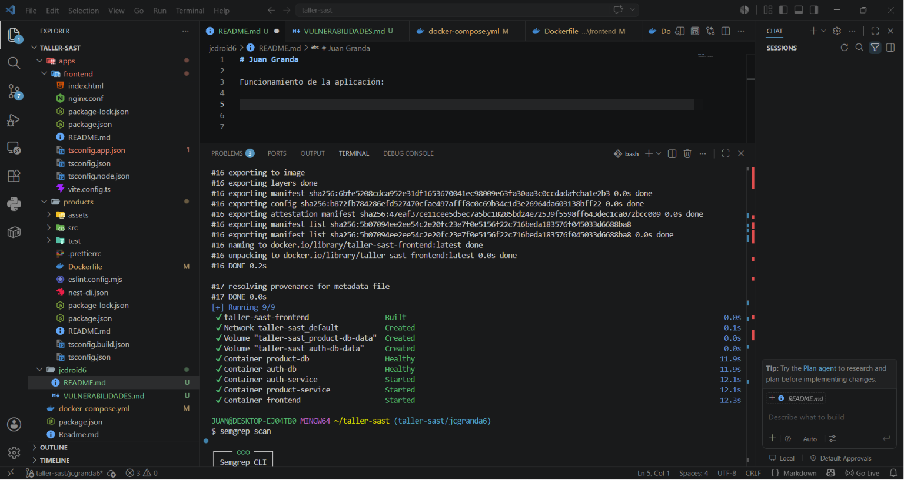
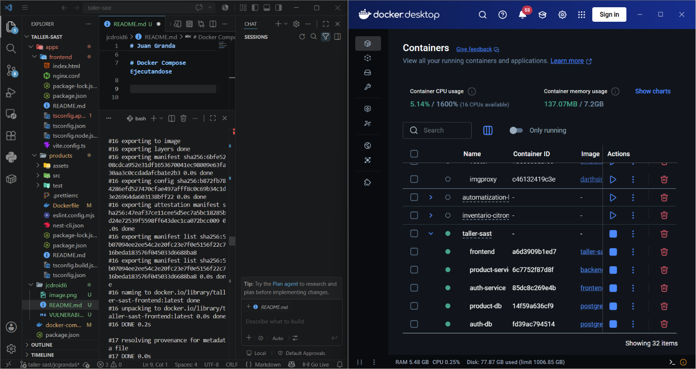
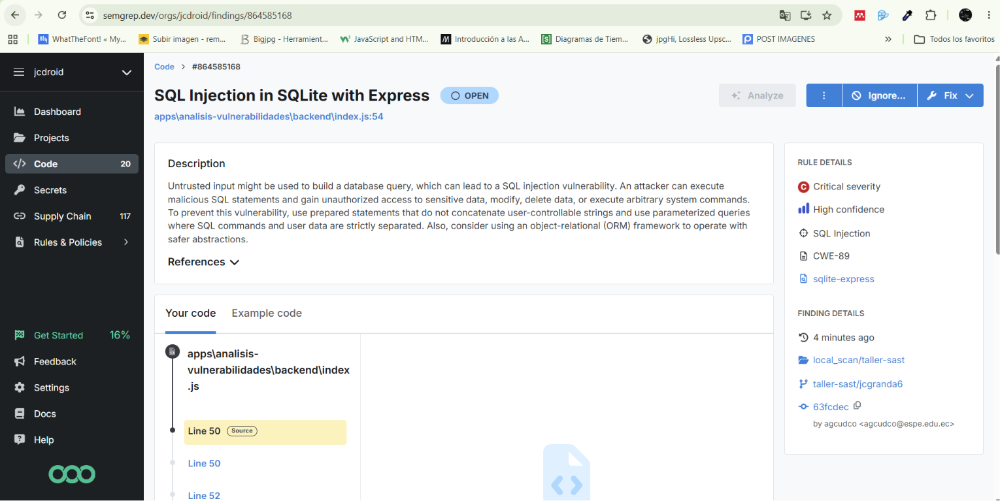
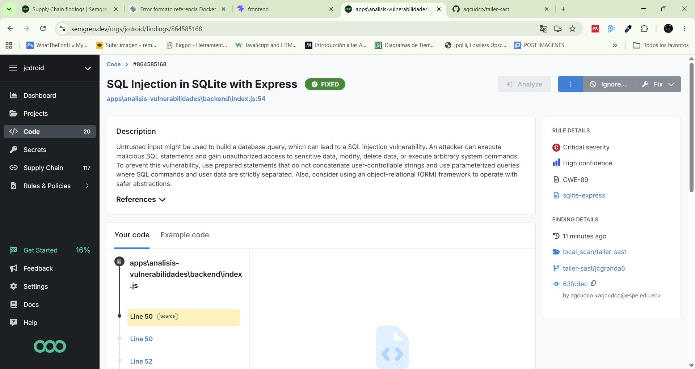
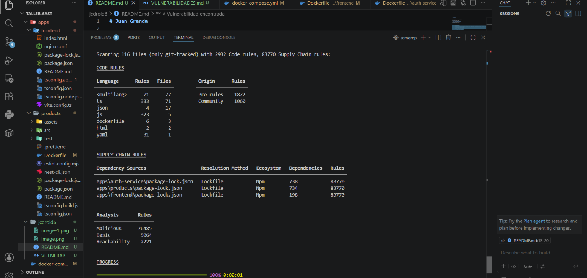
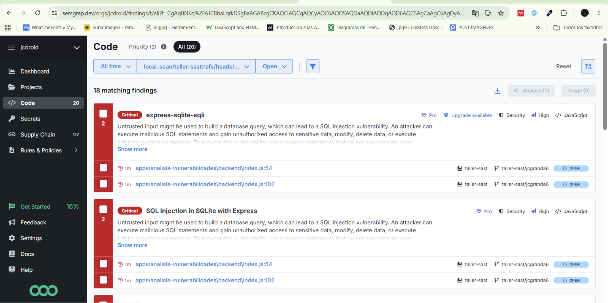

# Juan Granda

Funcionamiento de la aplicación:



# Docker Compose Ejecutandose



Para ejecutar el proyecto, se debe ejecutar el siguiente comando en la terminal se deben crear las imagenes de los contenedores y luego levantar los servicios de la aplicación

# Vulnerabilidad Encontrada




La alerta significa que la aplicación está usando datos que vienen del usuario directamente dentro de una consulta SQL, lo que abre la puerta a una vulnerabilidad conocida como SQL Injection según el estándar de seguridad de OWASP (A03: Injection). Esto ocurre porque un atacante podría enviar texto malicioso que cambie el significado de la consulta y haga que la base de datos ejecute acciones no previstas, como saltarse autenticación o acceder a información sensible. Para controlarlo, la forma correcta es nunca concatenar texto en las consultas, sino usar consultas parametrizadas o prepared statements, donde el código SQL y los datos del usuario se mantienen separados, asegurando que lo que ingresa el usuario siempre sea tratado como información y no como instrucciones.

# Vulnerabilidad 



## Codigo Corregido:

```typescript
app.get('/api/categories/search', (req, res) => {
  const searchTerm = req.query.name || '';

  const query = `
    SELECT * FROM categories
    WHERE name LIKE ?
  `;

  const param = `%${searchTerm}%`;

  console.log('[SQLi Categories FIXED]', query);

  db.all(query, [param], (err, rows) => {
    if (err) return res.status(500).json({ error: err.message });
    res.json(rows);
  });
});
```

# semgrp ci






