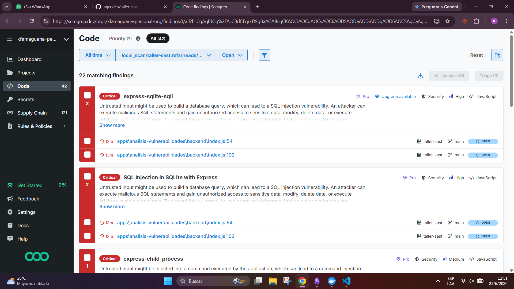

# Reporte de Escaneo Semgrep

**Nombre:** Kevin Amaguaña Casa

---

## Antes de corregir

| Tipo | Cantidad |
|------|----------|
| **Hallazgos totales** | **29** |
| Supply Chain (Undetermined) | 4 |
| Supply Chain (Unreachable) | 3 |
| Code (Non-blocking) | 22 |
| **Bloqueantes** | **0** |

---

## Código (22 hallazgos iniciales)

| Categoría | Archivo | Hallazgos |
|-----------|---------|-----------|
| SQL Injection | `apps/analisis-vulnerabilidades/backend/index.js` | 6 (3 por ruta: categorías y productos) |
| Command Injection | `apps/analisis-vulnerabilidades/backend/index.js` | 3 (ruta `/api/exec`) |
| CORS Permisivo | `apps/analisis-vulnerabilidades/backend/index.js` | 1 (origin: '*') |
| CSRF | `apps/analisis-vulnerabilidades/backend/index.js` | 1 (sin middleware) |
| Missing Integrity | `apps/analisis-vulnerabilidades/frontend/index.html` | 2 (Bootstrap CDN) |
| Missing USER (root) | Dockerfiles (x3) | 3 (auth-service, frontend, products) |
| H2C Smuggling | `apps/frontend/nginx.conf` | 1 |
| docker-compose | `docker-compose.yml` | 4 (no-new-privileges x2, writable-fs x2) |

---

## Correcciones aplicadas

| Vulnerabilidad | Archivo | Cambio realizado | Hallazgos eliminados |
|---------------|---------|-----------------|---------------------|
| SQL Injection (categorías) | `backend/index.js` | `LIKE '%${term}%'` → `LIKE ?` con parámetros | 3 |
| SQL Injection (productos) | `backend/index.js` | `LIKE '%${term}%'` → `LIKE ?` con parámetros | 3 |
| CORS Permisivo | `backend/index.js` | `origin: '*'` → `origin: 'http://localhost:3000'` | 1 |
| Command Injection | `backend/index.js` | Whitelist de comandos permitidos + validación | 0* |
| Missing USER (root) | Dockerfiles (x3) | `USER node` / `USER nginx` antes de CMD | 3 |
| H2C Smuggling | `nginx.conf` | Eliminados headers Upgrade/Connection | 1 |
| docker-compose | `docker-compose.yml` | `security_opt` + `read_only` + `tmpfs` | 4 |
| Missing Integrity | `frontend/index.html` | `integrity` + `crossorigin` en CDN | 2 |

*\*Command Injection: semgrep sigue detectando el uso de `exec()` con input del usuario (3 reglas), aunque ahora está restringido por whitelist.*

---

## Después de corregir

```
┌───────────────────────────┐
│ 4 Non-blocking Code Findings │
└───────────────────────────┘

  apps\analisis-vulnerabilidades\backend\index.js
  ❱ CSRF middleware no detectado
  ❱ Command Injection (3 reglas - exec con whitelist)


┌──────────────────────────────────────┐
│ 4 Undetermined Supply Chain Findings │
└──────────────────────────────────────┘

  ❱ js-yaml CVE-2026-53550 (x2)
  ❱ multer CVE-2026-5038 (x2)


┌───────────────────────────────┐
│ 3 Unreachable Supply Chain Findings │
└───────────────────────────────┘

  ❱ multer CVE-2026-5079 (x2)
  ❱ form-data CVE-2026-12143 (x1)


┌──────────────┐
│ Scan Summary │
└──────────────┘
✅ Findings: 11 (0 blocking)
   Code: 4  |  Supply Chain: 7
```


