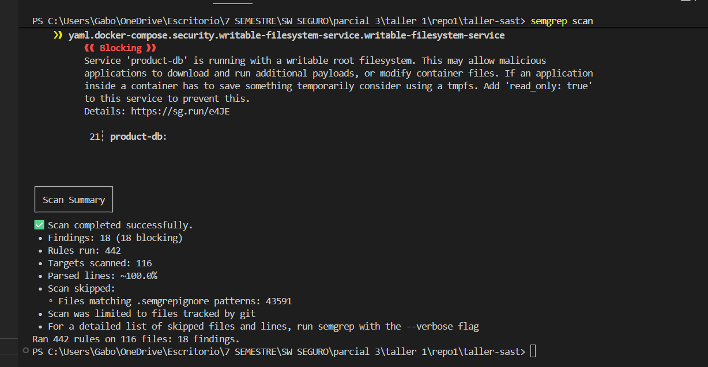
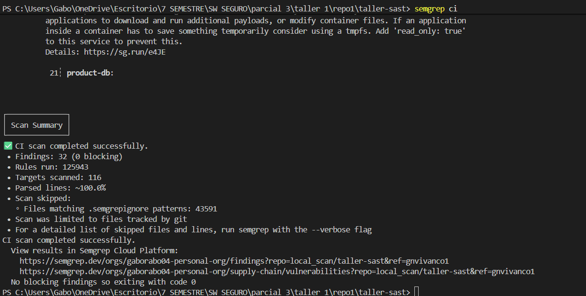
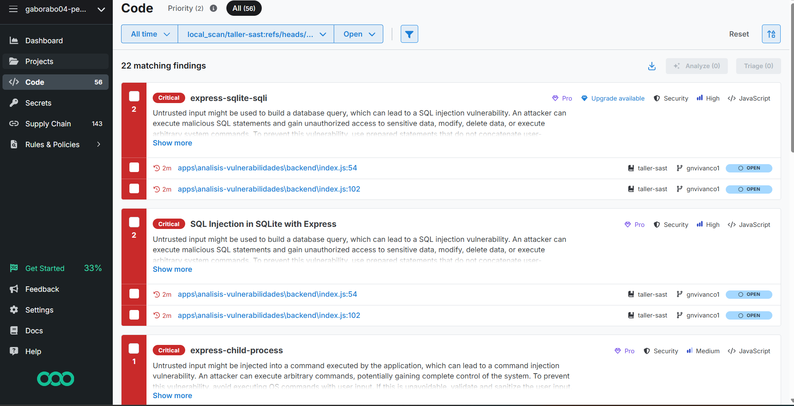
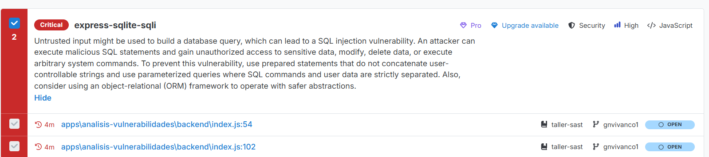
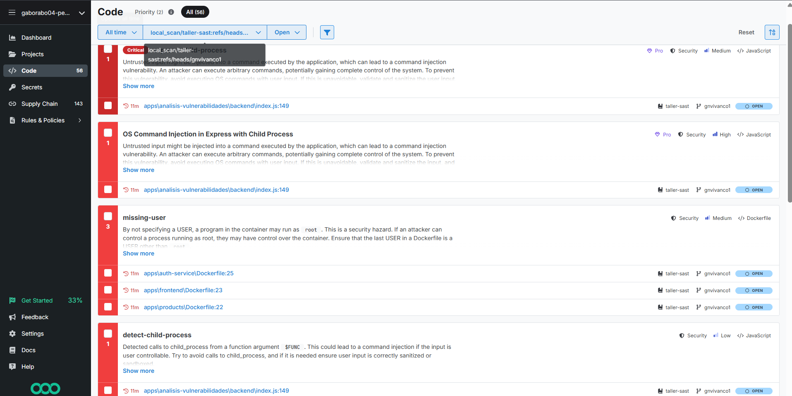

PS C:\Users\Gabo\OneDrive\Escritorio\7 SEMESTRE\SW SEGURO\parcial 3\taller 1\repo1\taller-sast> semgrep scan

┌──── ○○○ ────┐
│ Semgrep CLI │
└─────────────┘

Scanning 116 files (only git-tracked) with:
                                      
✔ Semgrep OSS
  ✔ Basic security coverage for first-party code vulnerabilities.
                                              
✔ Semgrep Code (SAST)
  ✔ Find and fix vulnerabilities in the code you write with advanced scanning and expert security rules.
                                                     
✘ Semgrep Supply Chain (SCA)
  ✘ Find and fix the reachable vulnerabilities in your OSS dependencies.
 
  ━━━━━━━━━━━━━━━━━━━━━━━━━━━━━━━━━━━━━━━━ 100% 0:00:06                                                                                                                        
                    
                    
┌──────────────────┐
│ 18 Code Findings │
└──────────────────┘
                                                                  
    apps\analisis-vulnerabilidades\backend\index.js
     ❱ javascript.express.security.audit.express-check-csurf-middleware-usage.express-check-csurf-middleware-usage
          ❰❰ Blocking ❱❱
          A CSRF middleware was not detected in your express application. Ensure you are either using one such
          as `csurf` or `csrf` (see rule references) and/or you are properly doing CSRF validation in your    
          routes with a token or cookies.                                                                     
          Details: https://sg.run/BxzR                                                                        
                                                                                                              
            7┆ const app = express();
   
     ❱ javascript.express.log.console-log-express.console-log-express
          ❰❰ Blocking ❱❱
          Detected a logger that logs user input without properly neutralizing the output. The log message  
          could contain characters like ` ` and ` ` and cause an attacker to forge log entries or include   
          malicious content into the logs. Use proper input validation and/or output encoding to prevent log
          entries from being forged.                                                                        
          Details: https://sg.run/pK7Ok                                                                     
                                                                                                            
           53┆ console.log('[SQLi Categories]', query);
   
   ❯❯❯❱ javascript.express.express-sqlite-sqli.express-sqlite-sqli
          ❰❰ Blocking ❱❱
          Untrusted input might be used to build a database query, which can lead to a SQL injection         
          vulnerability. An attacker can execute malicious SQL statements and gain unauthorized access to    
          sensitive data, modify, delete data, or execute arbitrary system commands. To prevent this         
          vulnerability, use prepared statements that do not concatenate user-controllable strings and use   
          parameterized queries where SQL commands and user data are strictly separated. Also, consider using
          an object-relational (ORM) framework to operate with safer abstractions.                           
          Details: https://sg.run/76lG                                                                       
                                                                                                             
           54┆ db.all(query, (err, rows) => {
   
     ❱ javascript.express.log.console-log-express.console-log-express
          ❰❰ Blocking ❱❱
          Detected a logger that logs user input without properly neutralizing the output. The log message  
          could contain characters like ` ` and ` ` and cause an attacker to forge log entries or include   
          malicious content into the logs. Use proper input validation and/or output encoding to prevent log
          entries from being forged.                                                                        
          Details: https://sg.run/pK7Ok                                                                     
                                                                                                            
          101┆ console.log('[SQLi Products]', query);
   
   ❯❯❯❱ javascript.express.express-sqlite-sqli.express-sqlite-sqli
          ❰❰ Blocking ❱❱
          Untrusted input might be used to build a database query, which can lead to a SQL injection         
          vulnerability. An attacker can execute malicious SQL statements and gain unauthorized access to    
          sensitive data, modify, delete data, or execute arbitrary system commands. To prevent this         
          vulnerability, use prepared statements that do not concatenate user-controllable strings and use   
          parameterized queries where SQL commands and user data are strictly separated. Also, consider using
          an object-relational (ORM) framework to operate with safer abstractions.                           
          Details: https://sg.run/76lG                                                                       
                                                                                                             
          102┆ db.all(query, (err, rows) => {
   
   ❯❯❯❱ javascript.express.express-child-process.express-child-process
          ❰❰ Blocking ❱❱
          Untrusted input might be injected into a command executed by the application, which can lead to a   
          command injection vulnerability. An attacker can execute arbitrary commands, potentially gaining    
          complete control of the system. To prevent this vulnerability, avoid executing OS commands with user
          input. If this is unavoidable, validate and sanitize the user input, and use safe methods for       
          executing the commands. For more information, see [Command injection prevention for JavaScript ]    
          (https://semgrep.dev/docs/cheat-sheets/javascript-command-injection/).                              
          Details: https://sg.run/9p1R                                                                        
                                                                                                              
          154┆ exec(cmd, (error, stdout, stderr) => {
   
   ❯❯❱ javascript.lang.security.detect-child-process.detect-child-process
          ❰❰ Blocking ❱❱
          Detected calls to child_process from a function argument `req`. This could lead to a command  
          injection if the input is user controllable. Try to avoid calls to child_process, and if it is
          needed ensure user input is correctly sanitized or sandboxed.                                 
          Details: https://sg.run/l2lo                                                                  
                                                                                                        
          154┆ exec(cmd, (error, stdout, stderr) => {
                                                                     
    apps\analisis-vulnerabilidades\frontend\index.html
    ❯❱ html.security.audit.missing-integrity.missing-integrity
          ❰❰ Blocking ❱❱
          This tag is missing an 'integrity' subresource integrity attribute. The 'integrity' attribute allows
          for the browser to verify that externally hosted files (for example from a CDN) are delivered       
          without unexpected manipulation. Without this attribute, if an attacker can modify the externally   
          hosted resource, this could lead to XSS and other types of attacks. To prevent this, include the    
          base64-encoded cryptographic hash of the resource (file) you’re telling the browser to fetch in the 
          'integrity' attribute for all externally hosted files.                                              
          Details: https://sg.run/krXA                                                                        
                                                                                                              
            8┆ <link                                                                                
               href="https://cdn.jsdelivr.net/npm/bootstrap@5.3.0-alpha1/dist/css/bootstrap.min.css"
               rel="stylesheet">                                                                    
            ⋮┆----------------------------------------
          100┆ <script src="https://cdn.jsdelivr.net/npm/bootstrap@5.3.0-
               alpha1/dist/js/bootstrap.bundle.min.js"></script>         
                                               
    apps\auth-service\Dockerfile
   ❯❯❱ dockerfile.security.missing-user.missing-user
          ❰❰ Blocking ❱❱
          By not specifying a USER, a program in the container may run as 'root'. This is a security hazard.
          If an attacker can control a process running as root, they may have control over the container.   
          Ensure that the last USER in a Dockerfile is a USER other than 'root'.                            
          Details: https://sg.run/Gbvn                                                                      
                                                                                                            
           ▶▶┆ Autofix ▶ USER non-root CMD ["node", "dist/main"]
           25┆ CMD ["node", "dist/main"]
                                           
    apps\frontend\Dockerfile
   ❯❯❱ dockerfile.security.missing-user.missing-user
          ❰❰ Blocking ❱❱
          By not specifying a USER, a program in the container may run as 'root'. This is a security hazard.
          If an attacker can control a process running as root, they may have control over the container.   
          Ensure that the last USER in a Dockerfile is a USER other than 'root'.                            
          Details: https://sg.run/Gbvn                                                                      
                                                                                                            
           ▶▶┆ Autofix ▶ USER non-root CMD ["nginx", "-g", "daemon off;"]
           23┆ CMD ["nginx", "-g", "daemon off;"]
                                           
    apps\frontend\nginx.conf
    ❯❱ generic.nginx.security.possible-h2c-smuggling.possible-nginx-h2c-smuggling
          ❰❰ Blocking ❱❱
          Conditions for Nginx H2C smuggling identified. H2C smuggling allows upgrading HTTP/1.1 connections 
          to lesser-known HTTP/2 over cleartext (h2c) connections which can allow a bypass of reverse proxy  
          access controls, and lead to long-lived, unrestricted HTTP traffic directly to back-end servers. To
          mitigate: WebSocket support required: Allow only the value websocket for HTTP/1.1 upgrade headers  
          (e.g., Upgrade: websocket). WebSocket support not required: Do not forward Upgrade headers.        
          Details: https://sg.run/ploZ                                                                       
                                                                                                             
           16┆ proxy_http_version 1.1;
           17┆ proxy_set_header Upgrade $http_upgrade;
           18┆ proxy_set_header Connection 'upgrade';
            ⋮┆----------------------------------------
           25┆ proxy_http_version 1.1;
           26┆ proxy_set_header Upgrade $http_upgrade;
           27┆ proxy_set_header Connection 'upgrade';
                                           
    apps\products\Dockerfile
   ❯❯❱ dockerfile.security.missing-user.missing-user
          ❰❰ Blocking ❱❱
          By not specifying a USER, a program in the container may run as 'root'. This is a security hazard.
          If an attacker can control a process running as root, they may have control over the container.   
          Ensure that the last USER in a Dockerfile is a USER other than 'root'.                            
          Details: https://sg.run/Gbvn                                                                      
                                                                                                            
           ▶▶┆ Autofix ▶ USER non-root CMD ["node", "dist/main"]
           22┆ CMD ["node", "dist/main"]
                                     
    docker-compose.yml
    ❯❱ yaml.docker-compose.security.no-new-privileges.no-new-privileges
          ❰❰ Blocking ❱❱
          Service 'auth-db' allows for privilege escalation via setuid or setgid binaries. Add 'no-new-
          privileges:true' in 'security_opt' to prevent this.                                          
          Details: https://sg.run/0n8q                                                                 
                                                                                                       
            4┆ auth-db:
   
    ❯❱ yaml.docker-compose.security.writable-filesystem-service.writable-filesystem-service
          ❰❰ Blocking ❱❱
          Service 'auth-db' is running with a writable root filesystem. This may allow malicious applications
          to download and run additional payloads, or modify container files. If an application inside a     
          container has to save something temporarily consider using a tmpfs. Add 'read_only: true' to this  
          service to prevent this.                                                                           
          Details: https://sg.run/e4JE                                                                       
                                                                                                             
            4┆ auth-db:
   
    ❯❱ yaml.docker-compose.security.no-new-privileges.no-new-privileges
          ❰❰ Blocking ❱❱
          Service 'product-db' allows for privilege escalation via setuid or setgid binaries. Add 'no-new-
          privileges:true' in 'security_opt' to prevent this.                                             
          Details: https://sg.run/0n8q                                                                    
                                                                                                          
           21┆ product-db:
   
    ❯❱ yaml.docker-compose.security.writable-filesystem-service.writable-filesystem-service
          ❰❰ Blocking ❱❱
          Service 'product-db' is running with a writable root filesystem. This may allow malicious         
          applications to download and run additional payloads, or modify container files. If an application
          inside a container has to save something temporarily consider using a tmpfs. Add 'read_only: true'
          to this service to prevent this.                                                                  
          Details: https://sg.run/e4JE                                                                      
                                                                                                            
           21┆ product-db:

                
                
┌──────────────┐
│ Scan Summary │
└──────────────┘
✅ Scan completed successfully.
 • Findings: 18 (18 blocking)
 • Rules run: 442
 • Targets scanned: 116
 • Parsed lines: ~100.0%
 • Scan skipped: 
   ◦ Files matching .semgrepignore patterns: 43591
 • Scan was limited to files tracked by git
 • For a detailed list of skipped files and lines, run semgrep with the --verbose flag
Ran 442 rules on 116 files: 18 findings.


EJECUCION 1 SEMGREP SCAN



SEMGREP CI
PS C:\Users\Gabo\OneDrive\Escritorio\7 SEMESTRE\SW SEGURO\parcial 3\taller 1\repo1\taller-sast> semgrep ci                   
                                 
                  
┌────────────────┐
│ Debugging Info │
└────────────────┘
                  
  SCAN ENVIRONMENT
  versions    - semgrep 1.168.0 on python 3.11.0                       
  environment - running in environment git, triggering event is unknown
            
  CONNECTION
  Initializing scan (deployment=gaborabo04-personal-org, scan_id=185957478)  
  Enabled products: Supply Chain, Code                                                                                                                                                               
        
        
  ENGINE
  Using Semgrep Pro Version: 1.168.0
  Installed at C:\Users\Gabo\AppData\Local\Programs\Python\Python311\Lib\site-packages\semgrep\bin\semgrep-core-propriet
                                                                                                                        
  Scanning 116 files (only git-tracked) with 2932 Code rules, 83770 Supply Chain rules:
            
  CODE RULES
                                                                                                                        
  Language      Rules   Files          Origin      Rules                                                                
 ─────────────────────────────        ───────────────────                                                               
  <multilang>      71      77          Pro rules    1872                                                                
  ts              333      71          Community    1060                                                                
  json              4      18                                                                                           
  js              323       5                                                                                           
  dockerfile        6       3                                                                                           
  html              2       2                                                                                           
  yaml             31       1                                                                                           
                                                                                                                        
                    
  SUPPLY CHAIN RULES
                                                                                                                        
  Dependency Sources                    Resolution Method   Ecosystem   Dependencies   Rules                            
 ────────────────────────────────────────────────────────────────────────────────────────────                           
  package-lock.json                     Lockfile            Npm         871            83770                            
  apps\auth-service\package-lock.json   Lockfile            Npm         738            83770                            
  apps\products\package-lock.json       Lockfile            Npm         734            83770                            
  apps\frontend\package-lock.json       Lockfile            Npm         198            83770                            
                                                                                                                        
                                                                                                                        
  Analysis       Rules                                                                                                  
 ──────────────────────                                                                                                 
  Malicious      76485                                                                                                  
  Basic           5064                                                                                                  
  Reachability    2221                                                                                                  
                                                                                                                        
          
  PROGRESS
   
  ━━━━━━━━━━━━━━━━━━━━━━━━━━━━━━━━━━━━━━━━ 100% 0:00:04                                                                                                                        
  Uploading scan results  
  Finalizing scan                                                                                                                                 
                                        
                                        
┌──────────────────────────────────────┐
│ 6 Undetermined Supply Chain Findings │
└──────────────────────────────────────┘
                                                      
    apps\auth-service\package-lock.json
    ❯❱ js-yaml - CVE-2026-53550
          Severity: MODERATE                                                      
          Affected versions of js-yaml are vulnerable to Inefficient Algorithmic Complexity.
                                                                                            
           ▶▶┆ Fixed for js-yaml at version: 4.2.0
          1518┆ "node_modules/@istanbuljs/load-nyc-config/node_modules/js-yaml": {
   
    ❯❱ multer - CVE-2026-5038
          Severity: MODERATE                                     
          Affected versions of multer are vulnerable to Incomplete Cleanup.
                                                                           
           ▶▶┆ Fixed for multer at versions: 2.2.0, 3.0.0-alpha.2
          7933┆ "node_modules/multer": {
                                                  
    apps\products\package-lock.json
    ❯❱ js-yaml - CVE-2026-53550
          Severity: MODERATE                                                      
          Affected versions of js-yaml are vulnerable to Inefficient Algorithmic Complexity.
                                                                                            
           ▶▶┆ Fixed for js-yaml at version: 4.2.0
          1516┆ "node_modules/@istanbuljs/load-nyc-config/node_modules/js-yaml": {
   
    ❯❱ multer - CVE-2026-5038
          Severity: MODERATE                                     
          Affected versions of multer are vulnerable to Incomplete Cleanup.
                                                                           
           ▶▶┆ Fixed for multer at versions: 2.2.0, 3.0.0-alpha.2
          7889┆ "node_modules/multer": {
                                    
    package-lock.json
    ❯❱ js-yaml - CVE-2026-53550
          Severity: MODERATE                                                      
          Affected versions of js-yaml are vulnerable to Inefficient Algorithmic Complexity.
                                                                                            
           ▶▶┆ Fixed for js-yaml at version: 4.2.0
          1769┆ "node_modules/@istanbuljs/load-nyc-config/node_modules/js-yaml": {
   
    ❯❱ multer - CVE-2026-5038
          Severity: MODERATE                                     
          Affected versions of multer are vulnerable to Incomplete Cleanup.
                                                                           
           ▶▶┆ Fixed for multer at versions: 2.2.0, 3.0.0-alpha.2
          9425┆ "node_modules/multer": {
                                       
                                       
┌─────────────────────────────────────┐
│ 4 Unreachable Supply Chain Findings │
└─────────────────────────────────────┘
                                                      
    apps\auth-service\package-lock.json
   ❯❯❱ multer - CVE-2026-5079
          Severity: HIGH                                                                          
          Affected versions of multer are vulnerable to Uncontrolled Resource Consumption. Multer is        
          vulnerable to denial of service via deeply nested field names in multipart form data. The `append-
          field` dependency parses bracket-notation field names (e.g. `a[b][c]`) without limiting nesting   
          depth, so a single malicious multipart request can force allocation of deeply nested object       
          structures and exhaust CPU and memory. Field parsing runs for every multipart body regardless of  
          which middleware method is used, so any application that constructs a Multer instance to handle   
          uploads is exposed.                                                                               
                                                                                                            
           ▶▶┆ Fixed for multer at versions: 2.2.0, 3.0.0-alpha.2
          7933┆ "node_modules/multer": {
                                                  
    apps\products\package-lock.json
   ❯❯❱ form-data - CVE-2026-12143
          Severity: HIGH                                                                            
          Affected versions of form-data are vulnerable to Improper Neutralization of CRLF Sequences ('CRLF   
          Injection'). form-data does not escape carriage return, line feed, or double-quote characters in the
          field name and `filename` option passed to `FormData#append()`. These values are concatenated       
          directly into the `Content-Disposition` header, so passing untrusted input as a field name or       
          filename lets an attacker inject CRLF sequences and smuggle additional multipart headers/parts (e.g.
          overriding backend-trusted fields).                                                                 
                                                                                                              
           ▶▶┆ Fixed for form-data at versions: 2.5.6, 3.0.5, 4.0.6
          5810┆ "node_modules/form-data": {
   
   ❯❯❱ multer - CVE-2026-5079
          Severity: HIGH                                                                          
          Affected versions of multer are vulnerable to Uncontrolled Resource Consumption. Multer is        
          vulnerable to denial of service via deeply nested field names in multipart form data. The `append-
          field` dependency parses bracket-notation field names (e.g. `a[b][c]`) without limiting nesting   
          depth, so a single malicious multipart request can force allocation of deeply nested object       
          structures and exhaust CPU and memory. Field parsing runs for every multipart body regardless of  
          which middleware method is used, so any application that constructs a Multer instance to handle   
          uploads is exposed.                                                                               
                                                                                                            
           ▶▶┆ Fixed for multer at versions: 2.2.0, 3.0.0-alpha.2
          7889┆ "node_modules/multer": {
                                    
    package-lock.json
   ❯❯❱ multer - CVE-2026-5079
          Severity: HIGH                                                                          
          Affected versions of multer are vulnerable to Uncontrolled Resource Consumption. Multer is        
          vulnerable to denial of service via deeply nested field names in multipart form data. The `append-
          field` dependency parses bracket-notation field names (e.g. `a[b][c]`) without limiting nesting   
          depth, so a single malicious multipart request can force allocation of deeply nested object       
          structures and exhaust CPU and memory. Field parsing runs for every multipart body regardless of  
          which middleware method is used, so any application that constructs a Multer instance to handle   
          uploads is exposed.                                                                               
                                                                                                            
           ▶▶┆ Fixed for multer at versions: 2.2.0, 3.0.0-alpha.2
          9425┆ "node_modules/multer": {
                                 
                                 
┌───────────────────────────────┐
│ 22 Non-blocking Code Findings │
└───────────────────────────────┘
                                                                  
    apps\analisis-vulnerabilidades\backend\index.js
     ❱ javascript.express.security.audit.express-check-csurf-middleware-usage.express-check-csurf-middleware-usage
          A CSRF middleware was not detected in your express application. Ensure you are either using one such
          as `csurf` or `csrf` (see rule references) and/or you are properly doing CSRF validation in your    
          routes with a token or cookies.                                                                     
          Details: https://sg.run/BxzR                                                                        
                                                                                                              
            7┆ const app = express();
   
    ❯❱ javascript.express.web.cors-permissive-express.cors-permissive-express
          A permissive Cross-Origin Resource Sharing (CORS) vulnerability occurs when a server's CORS policy  
          allows any origin to access its resources or improperly validates allowed origins. This can enable  
          attackers to make unauthorized cross-origin requests, potentially exposing sensitive data to        
          malicious websites. Avoid using wildcard (*) origins, especially for endpoints that handle sensitive
          data. Use a restrictive CORS policy by explicitly specifying trusted origins in the Access-Control- 
          Allow-Origin header.                                                                                
          Details: https://sg.run/0oKpJ                                                                       
                                                                                                              
           11┆ app.use(cors({ origin: '*' }));
    
    
          Taint comes from:
    
           11┆ app.use(cors({ origin: '*' }));
    
    
                This is how taint reaches the sink:
    
           11┆ app.use(cors({ origin: '*' }));
    
    
            ⋮┆----------------------------------------
   
     ❱ javascript.express.log.console-log-express.console-log-express
          Detected a logger that logs user input without properly neutralizing the output. The log message  
          could contain characters like ` ` and ` ` and cause an attacker to forge log entries or include   
          malicious content into the logs. Use proper input validation and/or output encoding to prevent log
          entries from being forged.                                                                        
          Details: https://sg.run/pK7Ok                                                                     
                                                                                                            
           53┆ console.log('[SQLi Categories]', query);
    
    
          Taint comes from:
    
           50┆ const searchTerm = req.query.name || '';
    
    
          Taint flows through these intermediate variables:
    
           50┆ const searchTerm = req.query.name || '';
    
           52┆ const query = `SELECT * FROM categories WHERE name LIKE '%${searchTerm}%'`;
    
    
                This is how taint reaches the sink:
    
           53┆ console.log('[SQLi Categories]', query);
    
    
            ⋮┆----------------------------------------
   
   ❯❯❯❱ javascript.express.db.sqlite-express.sqlite-express
          Untrusted input might be used to build a database query, which can lead to a SQL injection         
          vulnerability. An attacker can execute malicious SQL statements and gain unauthorized access to    
          sensitive data, modify, delete data, or execute arbitrary system commands. To prevent this         
          vulnerability, use prepared statements that do not concatenate user-controllable strings and use   
          parameterized queries where SQL commands and user data are strictly separated. Also, consider using
          an object-relational (ORM) framework to operate with safer abstractions.                           
          Details: https://sg.run/oqEJ7                                                                      
                                                                                                             
           54┆ db.all(query, (err, rows) => {
    
    
          Taint comes from:
    
           50┆ const searchTerm = req.query.name || '';
    
    
          Taint flows through these intermediate variables:
    
           50┆ const searchTerm = req.query.name || '';
    
           52┆ const query = `SELECT * FROM categories WHERE name LIKE '%${searchTerm}%'`;
    
    
                This is how taint reaches the sink:
    
           54┆ db.all(query, (err, rows) => {
    
    
            ⋮┆----------------------------------------
   
   ❯❯❯❱ javascript.express.express-sqlite-sqli.express-sqlite-sqli
          Untrusted input might be used to build a database query, which can lead to a SQL injection         
          vulnerability. An attacker can execute malicious SQL statements and gain unauthorized access to    
          sensitive data, modify, delete data, or execute arbitrary system commands. To prevent this         
          vulnerability, use prepared statements that do not concatenate user-controllable strings and use   
          parameterized queries where SQL commands and user data are strictly separated. Also, consider using
          an object-relational (ORM) framework to operate with safer abstractions.                           
          Details: https://sg.run/76lG                                                                       
                                                                                                             
           54┆ db.all(query, (err, rows) => {
    
    
          Taint comes from:
    
           50┆ const searchTerm = req.query.name || '';
    
    
          Taint flows through these intermediate variables:
    
           50┆ const searchTerm = req.query.name || '';
    
           52┆ const query = `SELECT * FROM categories WHERE name LIKE '%${searchTerm}%'`;
    
    
                This is how taint reaches the sink:
    
           54┆ db.all(query, (err, rows) => {
    
    
            ⋮┆----------------------------------------
   
     ❱ javascript.express.log.console-log-express.console-log-express
          Detected a logger that logs user input without properly neutralizing the output. The log message  
          could contain characters like ` ` and ` ` and cause an attacker to forge log entries or include   
          malicious content into the logs. Use proper input validation and/or output encoding to prevent log
          entries from being forged.                                                                        
          Details: https://sg.run/pK7Ok                                                                     
                                                                                                            
          101┆ console.log('[SQLi Products]', query);
    
    
          Taint comes from:
    
           99┆ const searchTerm = req.query.name || '';
    
    
          Taint flows through these intermediate variables:
    
           99┆ const searchTerm = req.query.name || '';
    
          100┆ const query = `SELECT * FROM products WHERE name LIKE '%${searchTerm}%'`;
    
    
                This is how taint reaches the sink:
    
          101┆ console.log('[SQLi Products]', query);
    
    
            ⋮┆----------------------------------------
   
   ❯❯❯❱ javascript.express.db.sqlite-express.sqlite-express
          Untrusted input might be used to build a database query, which can lead to a SQL injection         
          vulnerability. An attacker can execute malicious SQL statements and gain unauthorized access to    
          sensitive data, modify, delete data, or execute arbitrary system commands. To prevent this         
          vulnerability, use prepared statements that do not concatenate user-controllable strings and use   
          parameterized queries where SQL commands and user data are strictly separated. Also, consider using
          an object-relational (ORM) framework to operate with safer abstractions.                           
          Details: https://sg.run/oqEJ7                                                                      
                                                                                                             
          102┆ db.all(query, (err, rows) => {
    
    
          Taint comes from:
    
           99┆ const searchTerm = req.query.name || '';
    
    
          Taint flows through these intermediate variables:
    
           99┆ const searchTerm = req.query.name || '';
    
          100┆ const query = `SELECT * FROM products WHERE name LIKE '%${searchTerm}%'`;
    
    
                This is how taint reaches the sink:
    
          102┆ db.all(query, (err, rows) => {
    
    
            ⋮┆----------------------------------------
   
   ❯❯❯❱ javascript.express.express-sqlite-sqli.express-sqlite-sqli
          Untrusted input might be used to build a database query, which can lead to a SQL injection         
          vulnerability. An attacker can execute malicious SQL statements and gain unauthorized access to    
          sensitive data, modify, delete data, or execute arbitrary system commands. To prevent this         
          vulnerability, use prepared statements that do not concatenate user-controllable strings and use   
          parameterized queries where SQL commands and user data are strictly separated. Also, consider using
          an object-relational (ORM) framework to operate with safer abstractions.                           
          Details: https://sg.run/76lG                                                                       
                                                                                                             
          102┆ db.all(query, (err, rows) => {
    
    
          Taint comes from:
    
           99┆ const searchTerm = req.query.name || '';
    
    
          Taint flows through these intermediate variables:
    
           99┆ const searchTerm = req.query.name || '';
    
          100┆ const query = `SELECT * FROM products WHERE name LIKE '%${searchTerm}%'`;
    
    
                This is how taint reaches the sink:
    
          102┆ db.all(query, (err, rows) => {
    
    
            ⋮┆----------------------------------------
   
   ❯❯❯❱ javascript.express.express-child-process.express-child-process
          Untrusted input might be injected into a command executed by the application, which can lead to a   
          command injection vulnerability. An attacker can execute arbitrary commands, potentially gaining    
          complete control of the system. To prevent this vulnerability, avoid executing OS commands with user
          input. If this is unavoidable, validate and sanitize the user input, and use safe methods for       
          executing the commands. For more information, see [Command injection prevention for JavaScript ]    
          (https://semgrep.dev/docs/cheat-sheets/javascript-command-injection/).                              
          Details: https://sg.run/9p1R                                                                        
                                                                                                              
          154┆ exec(cmd, (error, stdout, stderr) => {
    
    
          Taint comes from:
    
          152┆ const cmd = req.query.cmd || '';
    
    
          Taint flows through these intermediate variables:
    
          152┆ const cmd = req.query.cmd || '';
    
    
                This is how taint reaches the sink:
    
          154┆ exec(cmd, (error, stdout, stderr) => {
    
    
            ⋮┆----------------------------------------
   
   ❯❯❱ javascript.express.os.tainted-os-command-child-process-express.tainted-os-command-child-process-express
          Untrusted input might be injected into a command executed by the application, which can lead to a   
          command injection vulnerability. An attacker can execute arbitrary commands, potentially gaining    
          complete control of the system. To prevent this vulnerability, avoid executing OS commands with user
          input. If this is unavoidable, validate and sanitize the input, and use safe methods for executing  
          the commands. For more information, see: [JavaScript command injection prevention]                  
          (https://semgrep.dev/docs/cheat-sheets/javascript-command-injection/)                               
          Details: https://sg.run/AbAz6                                                                       
                                                                                                              
          154┆ exec(cmd, (error, stdout, stderr) => {
    
    
          Taint comes from:
    
          152┆ const cmd = req.query.cmd || '';
    
    
          Taint flows through these intermediate variables:
    
          152┆ const cmd = req.query.cmd || '';
    
    
                This is how taint reaches the sink:
    
          154┆ exec(cmd, (error, stdout, stderr) => {
    
    
            ⋮┆----------------------------------------
   
   ❯❯❱ javascript.lang.security.detect-child-process.detect-child-process
          Detected calls to child_process from a function argument `req`. This could lead to a command  
          injection if the input is user controllable. Try to avoid calls to child_process, and if it is
          needed ensure user input is correctly sanitized or sandboxed.                                 
          Details: https://sg.run/l2lo                                                                  
                                                                                                        
          154┆ exec(cmd, (error, stdout, stderr) => {
    
    
          Taint comes from:
    
          151┆ app.get('/api/exec', (req, res) => {
    
    
          Taint flows through these intermediate variables:
    
          151┆ app.get('/api/exec', (req, res) => {
    
          152┆ const cmd = req.query.cmd || '';
    
    
                This is how taint reaches the sink:
    
          154┆ exec(cmd, (error, stdout, stderr) => {
    
                                                                     
    apps\analisis-vulnerabilidades\frontend\index.html
    ❯❱ html.security.audit.missing-integrity.missing-integrity
          This tag is missing an 'integrity' subresource integrity attribute. The 'integrity' attribute allows
          for the browser to verify that externally hosted files (for example from a CDN) are delivered       
          without unexpected manipulation. Without this attribute, if an attacker can modify the externally   
          hosted resource, this could lead to XSS and other types of attacks. To prevent this, include the    
          base64-encoded cryptographic hash of the resource (file) you’re telling the browser to fetch in the 
          'integrity' attribute for all externally hosted files.                                              
          Details: https://sg.run/krXA                                                                        
                                                                                                              
            8┆ <link                                                                                
               href="https://cdn.jsdelivr.net/npm/bootstrap@5.3.0-alpha1/dist/css/bootstrap.min.css"
               rel="stylesheet">                                                                    
            ⋮┆----------------------------------------
          100┆ <script src="https://cdn.jsdelivr.net/npm/bootstrap@5.3.0-
               alpha1/dist/js/bootstrap.bundle.min.js"></script>         
                                               
    apps\auth-service\Dockerfile
   ❯❯❱ dockerfile.security.missing-user.missing-user
          By not specifying a USER, a program in the container may run as 'root'. This is a security hazard.
          If an attacker can control a process running as root, they may have control over the container.   
          Ensure that the last USER in a Dockerfile is a USER other than 'root'.                            
          Details: https://sg.run/Gbvn                                                                      
                                                                                                            
           ▶▶┆ Autofix ▶ USER non-root CMD ["node", "dist/main"]
           25┆ USER non-rootCMD ["node", "dist/main"]
                                           
    apps\frontend\Dockerfile
   ❯❯❱ dockerfile.security.missing-user.missing-user
          By not specifying a USER, a program in the container may run as 'root'. This is a security hazard.
          If an attacker can control a process running as root, they may have control over the container.   
          Ensure that the last USER in a Dockerfile is a USER other than 'root'.                            
          Details: https://sg.run/Gbvn                                                                      
                                                                                                            
           ▶▶┆ Autofix ▶ USER non-root CMD ["nginx", "-g", "daemon off;"]
           23┆ USER non-rootCMD ["nginx", "-g", "daemon off;"]
                                           
    apps\frontend\nginx.conf
    ❯❱ generic.nginx.security.possible-h2c-smuggling.possible-nginx-h2c-smuggling
          Conditions for Nginx H2C smuggling identified. H2C smuggling allows upgrading HTTP/1.1 connections 
          to lesser-known HTTP/2 over cleartext (h2c) connections which can allow a bypass of reverse proxy  
          access controls, and lead to long-lived, unrestricted HTTP traffic directly to back-end servers. To
          mitigate: WebSocket support required: Allow only the value websocket for HTTP/1.1 upgrade headers  
          (e.g., Upgrade: websocket). WebSocket support not required: Do not forward Upgrade headers.        
          Details: https://sg.run/ploZ                                                                       
                                                                                                             
           16┆ proxy_http_version 1.1;
           17┆ proxy_set_header Upgrade $http_upgrade;
           18┆ proxy_set_header Connection 'upgrade';
            ⋮┆----------------------------------------
           25┆ proxy_http_version 1.1;
           26┆ proxy_set_header Upgrade $http_upgrade;
           27┆ proxy_set_header Connection 'upgrade';
                                           
    apps\products\Dockerfile
   ❯❯❱ dockerfile.security.missing-user.missing-user
          By not specifying a USER, a program in the container may run as 'root'. This is a security hazard.
          If an attacker can control a process running as root, they may have control over the container.   
          Ensure that the last USER in a Dockerfile is a USER other than 'root'.                            
          Details: https://sg.run/Gbvn                                                                      
                                                                                                            
           ▶▶┆ Autofix ▶ USER non-root CMD ["node", "dist/main"]
           22┆ USER non-rootCMD ["node", "dist/main"]
                                     
    docker-compose.yml
    ❯❱ yaml.docker-compose.security.no-new-privileges.no-new-privileges
          Service 'auth-db' allows for privilege escalation via setuid or setgid binaries. Add 'no-new-
          privileges:true' in 'security_opt' to prevent this.                                          
          Details: https://sg.run/0n8q                                                                 
                                                                                                       
            4┆ auth-db:
   
    ❯❱ yaml.docker-compose.security.writable-filesystem-service.writable-filesystem-service
          Service 'auth-db' is running with a writable root filesystem. This may allow malicious applications
          to download and run additional payloads, or modify container files. If an application inside a     
          container has to save something temporarily consider using a tmpfs. Add 'read_only: true' to this  
          service to prevent this.                                                                           
          Details: https://sg.run/e4JE                                                                       
                                                                                                             
            4┆ auth-db:
   
    ❯❱ yaml.docker-compose.security.no-new-privileges.no-new-privileges
          Service 'product-db' allows for privilege escalation via setuid or setgid binaries. Add 'no-new-
          privileges:true' in 'security_opt' to prevent this.                                             
          Details: https://sg.run/0n8q                                                                    
                                                                                                          
           21┆ product-db:
   
    ❯❱ yaml.docker-compose.security.writable-filesystem-service.writable-filesystem-service
          Service 'product-db' is running with a writable root filesystem. This may allow malicious         
          applications to download and run additional payloads, or modify container files. If an application
          inside a container has to save something temporarily consider using a tmpfs. Add 'read_only: true'
          to this service to prevent this.                                                                  
          Details: https://sg.run/e4JE                                                                      
                                                                                                            
           21┆ product-db:

                
                
┌──────────────┐
│ Scan Summary │
└──────────────┘
✅ CI scan completed successfully.
 • Findings: 32 (0 blocking)
 • Rules run: 125943
 • Targets scanned: 116
 • Parsed lines: ~100.0%
 • Scan skipped: 
   ◦ Files matching .semgrepignore patterns: 43591
 • Scan was limited to files tracked by git
 • For a detailed list of skipped files and lines, run semgrep with the --verbose flag
CI scan completed successfully.
  View results in Semgrep Cloud Platform:
    https://semgrep.dev/orgs/gaborabo04-personal-org/findings?repo=local_scan/taller-sast&ref=gnvivanco1
    https://semgrep.dev/orgs/gaborabo04-personal-org/supply-chain/vulnerabilities?repo=local_scan/taller-sast&ref=gnvivanco1
  No blocking findings so exiting with code 0
PS C:\Users\Gabo\OneDrive\Escritorio\7 SEMESTRE\SW SEGURO\parcial 3\taller 1\repo1\taller-sast> 



DASHBOARD



VULNERABILIDAD A CORREGIR 



---

## Corrección: SQL Injection en `apps/analisis-vulnerabilidades/backend/index.js`

**Regla detectada:** `express-sqlite-sqli` (Critical / High)

**Archivos afectados:**
- `apps/analisis-vulnerabilidades/backend/index.js` — líneas 54 y 102

---

### Descripción de la vulnerabilidad

Semgrep identificó que en los endpoints de búsqueda de categorías y productos, el input del usuario (`req.query.name`) se concatenaba directamente dentro del string SQL usando template literals:

```js
// VULNERABLE — línea 52 (categorías)
const query = `SELECT * FROM categories WHERE name LIKE '%${searchTerm}%'`;
db.all(query, (err, rows) => { ... });

// VULNERABLE — línea 100 (productos)
const query = `SELECT * FROM products WHERE name LIKE '%${searchTerm}%'`;
db.all(query, (err, rows) => { ... });
```

Un atacante podía enviar un valor como `' OR '1'='1` en el parámetro `name` para manipular la consulta SQL y obtener acceso no autorizado a datos, modificarlos, o en casos más graves, ejecutar comandos arbitrarios.

---

### Corrección aplicada

Se reemplazó la concatenación directa por **consultas parametrizadas**: el patrón `LIKE` se construye en JavaScript como dato, y se pasa como parámetro separado a `db.all`. De esta forma sqlite3 escapa el valor y nunca lo interpreta como parte de la estructura SQL.

```js
// CORREGIDO — categorías (index.js línea ~50)
db.all('SELECT * FROM categories WHERE name LIKE ?', [`%${searchTerm}%`], (err, rows) => {
  if (err) return res.status(500).json({ error: err.message });
  res.json(rows);
});

// CORREGIDO — productos (index.js línea ~99)
db.all('SELECT * FROM products WHERE name LIKE ?', [`%${searchTerm}%`], (err, rows) => {
  if (err) return res.status(500).json({ error: err.message });
  res.json(rows);
});
```

El `?` actúa como placeholder: sqlite3 vincula el valor `%searchTerm%` como dato, no como SQL, eliminando completamente el vector de inyección.

También se eliminaron los `console.log` que imprimían la query con el input del usuario, ya que Semgrep también los marcó como riesgo de log injection (`console-log-express`).

------------------------------------------------------------------------------------------------------------------------------------------------------------------------------------------------------------------------------------------

## ESCANEO CORREGIDO

PS C:\Users\Gabo\OneDrive\Escritorio\7 SEMESTRE\SW SEGURO\parcial 3\taller 1\repo1\taller-sast> semgrep ci
                  
                  
┌────────────────┐
│ Debugging Info │
└────────────────┘
                  
  SCAN ENVIRONMENT
  versions    - semgrep 1.168.0 on python 3.11.0                       
  environment - running in environment git, triggering event is unknown
            
  CONNECTION
  Initializing scan (deployment=gaborabo04-personal-org, scan_id=185963360)  
  Enabled products: Supply Chain, Code                                                                                                                                                               
        
        
  ENGINE
  Using Semgrep Pro Version: 1.168.0
  Installed at C:\Users\Gabo\AppData\Local\Programs\Python\Python311\Lib\site-packages\semgrep\bin\semgrep-core-propriet
                                                                                                                        
  Scanning 116 files (only git-tracked) with 2932 Code rules, 83770 Supply Chain rules:
            
  CODE RULES
                                                                                                                        
  Language      Rules   Files          Origin      Rules                                                                
 ─────────────────────────────        ───────────────────                                                               
  <multilang>      71      77          Pro rules    1872                                                                
  ts              333      71          Community    1060                                                                
  json              4      18                                                                                           
  js              323       5                                                                                           
  dockerfile        6       3                                                                                           
  html              2       2                                                                                           
  yaml             31       1                                                                                           
                                                                                                                        
                    
  SUPPLY CHAIN RULES
                                                                                                                        
  Dependency Sources                    Resolution Method   Ecosystem   Dependencies   Rules                            
 ────────────────────────────────────────────────────────────────────────────────────────────                           
  package-lock.json                     Lockfile            Npm         871            83770                            
  apps\auth-service\package-lock.json   Lockfile            Npm         738            83770                            
  apps\products\package-lock.json       Lockfile            Npm         734            83770                            
  apps\frontend\package-lock.json       Lockfile            Npm         198            83770                            
                                                                                                                        
                                                                                                                        
  Analysis       Rules                                                                                                  
 ──────────────────────                                                                                                 
  Malicious      76485                                                                                                  
  Basic           5064                                                                                                  
  Reachability    2221                                                                                                  
                                                                                                                        
          
  PROGRESS
   
  ━━━━━━━━━━━━━━━━━━━━━━━━━━━━━━━━━━━━━━━━ 100% 0:00:06                                                                                                                        
  Uploading scan results  
  Finalizing scan                                                                                                                                 
                                        
                                        
┌──────────────────────────────────────┐
│ 6 Undetermined Supply Chain Findings │
└──────────────────────────────────────┘
                                                      
    apps\auth-service\package-lock.json
    ❯❱ js-yaml - CVE-2026-53550
          Severity: MODERATE                                                      
          Affected versions of js-yaml are vulnerable to Inefficient Algorithmic Complexity.
                                                                                            
           ▶▶┆ Fixed for js-yaml at version: 4.2.0
          1518┆ "node_modules/@istanbuljs/load-nyc-config/node_modules/js-yaml": {
   
    ❯❱ multer - CVE-2026-5038
          Severity: MODERATE                                     
          Affected versions of multer are vulnerable to Incomplete Cleanup.
                                                                           
           ▶▶┆ Fixed for multer at versions: 2.2.0, 3.0.0-alpha.2
          7933┆ "node_modules/multer": {
                                                  
    apps\products\package-lock.json
    ❯❱ js-yaml - CVE-2026-53550
          Severity: MODERATE                                                      
          Affected versions of js-yaml are vulnerable to Inefficient Algorithmic Complexity.
                                                                                            
           ▶▶┆ Fixed for js-yaml at version: 4.2.0
          1516┆ "node_modules/@istanbuljs/load-nyc-config/node_modules/js-yaml": {
   
    ❯❱ multer - CVE-2026-5038
          Severity: MODERATE                                     
          Affected versions of multer are vulnerable to Incomplete Cleanup.
                                                                           
           ▶▶┆ Fixed for multer at versions: 2.2.0, 3.0.0-alpha.2
          7889┆ "node_modules/multer": {
                                    
    package-lock.json
    ❯❱ js-yaml - CVE-2026-53550
          Severity: MODERATE                                                      
          Affected versions of js-yaml are vulnerable to Inefficient Algorithmic Complexity.
                                                                                            
           ▶▶┆ Fixed for js-yaml at version: 4.2.0
          1769┆ "node_modules/@istanbuljs/load-nyc-config/node_modules/js-yaml": {
   
    ❯❱ multer - CVE-2026-5038
          Severity: MODERATE                                     
          Affected versions of multer are vulnerable to Incomplete Cleanup.
                                                                           
           ▶▶┆ Fixed for multer at versions: 2.2.0, 3.0.0-alpha.2
          9425┆ "node_modules/multer": {
                                       
                                       
┌─────────────────────────────────────┐
│ 4 Unreachable Supply Chain Findings │
└─────────────────────────────────────┘
                                                      
    apps\auth-service\package-lock.json
   ❯❯❱ multer - CVE-2026-5079
          Severity: HIGH                                                                          
          Affected versions of multer are vulnerable to Uncontrolled Resource Consumption. Multer is        
          vulnerable to denial of service via deeply nested field names in multipart form data. The `append-
          field` dependency parses bracket-notation field names (e.g. `a[b][c]`) without limiting nesting   
          depth, so a single malicious multipart request can force allocation of deeply nested object       
          structures and exhaust CPU and memory. Field parsing runs for every multipart body regardless of  
          which middleware method is used, so any application that constructs a Multer instance to handle   
          uploads is exposed.                                                                               
                                                                                                            
           ▶▶┆ Fixed for multer at versions: 2.2.0, 3.0.0-alpha.2
          7933┆ "node_modules/multer": {
                                                  
    apps\products\package-lock.json
   ❯❯❱ form-data - CVE-2026-12143
          Severity: HIGH                                                                            
          Affected versions of form-data are vulnerable to Improper Neutralization of CRLF Sequences ('CRLF   
          Injection'). form-data does not escape carriage return, line feed, or double-quote characters in the
          field name and `filename` option passed to `FormData#append()`. These values are concatenated       
          directly into the `Content-Disposition` header, so passing untrusted input as a field name or       
          filename lets an attacker inject CRLF sequences and smuggle additional multipart headers/parts (e.g.
          overriding backend-trusted fields).                                                                 
                                                                                                              
           ▶▶┆ Fixed for form-data at versions: 2.5.6, 3.0.5, 4.0.6
          5810┆ "node_modules/form-data": {
   
   ❯❯❱ multer - CVE-2026-5079
          Severity: HIGH                                                                          
          Affected versions of multer are vulnerable to Uncontrolled Resource Consumption. Multer is        
          vulnerable to denial of service via deeply nested field names in multipart form data. The `append-
          field` dependency parses bracket-notation field names (e.g. `a[b][c]`) without limiting nesting   
          depth, so a single malicious multipart request can force allocation of deeply nested object       
          structures and exhaust CPU and memory. Field parsing runs for every multipart body regardless of  
          which middleware method is used, so any application that constructs a Multer instance to handle   
          uploads is exposed.                                                                               
                                                                                                            
           ▶▶┆ Fixed for multer at versions: 2.2.0, 3.0.0-alpha.2
          7889┆ "node_modules/multer": {
                                    
    package-lock.json
   ❯❯❱ multer - CVE-2026-5079
          Severity: HIGH                                                                          
          Affected versions of multer are vulnerable to Uncontrolled Resource Consumption. Multer is        
          vulnerable to denial of service via deeply nested field names in multipart form data. The `append-
          field` dependency parses bracket-notation field names (e.g. `a[b][c]`) without limiting nesting   
          depth, so a single malicious multipart request can force allocation of deeply nested object       
          structures and exhaust CPU and memory. Field parsing runs for every multipart body regardless of  
          which middleware method is used, so any application that constructs a Multer instance to handle   
          uploads is exposed.                                                                               
                                                                                                            
           ▶▶┆ Fixed for multer at versions: 2.2.0, 3.0.0-alpha.2
          9425┆ "node_modules/multer": {
                                 
                                 
┌───────────────────────────────┐
│ 16 Non-blocking Code Findings │
└───────────────────────────────┘
                                                                  
    apps\analisis-vulnerabilidades\backend\index.js
     ❱ javascript.express.security.audit.express-check-csurf-middleware-usage.express-check-csurf-middleware-usage
          A CSRF middleware was not detected in your express application. Ensure you are either using one such
          as `csurf` or `csrf` (see rule references) and/or you are properly doing CSRF validation in your    
          routes with a token or cookies.                                                                     
          Details: https://sg.run/BxzR                                                                        
                                                                                                              
            7┆ const app = express();
   
    ❯❱ javascript.express.web.cors-permissive-express.cors-permissive-express
          A permissive Cross-Origin Resource Sharing (CORS) vulnerability occurs when a server's CORS policy  
          allows any origin to access its resources or improperly validates allowed origins. This can enable  
          attackers to make unauthorized cross-origin requests, potentially exposing sensitive data to        
          malicious websites. Avoid using wildcard (*) origins, especially for endpoints that handle sensitive
          data. Use a restrictive CORS policy by explicitly specifying trusted origins in the Access-Control- 
          Allow-Origin header.                                                                                
          Details: https://sg.run/0oKpJ                                                                       
                                                                                                              
           11┆ app.use(cors({ origin: '*' }));
    
    
          Taint comes from:
    
           11┆ app.use(cors({ origin: '*' }));
    
    
                This is how taint reaches the sink:
    
           11┆ app.use(cors({ origin: '*' }));
    
    
            ⋮┆----------------------------------------
   
   ❯❯❯❱ javascript.express.express-child-process.express-child-process
          Untrusted input might be injected into a command executed by the application, which can lead to a   
          command injection vulnerability. An attacker can execute arbitrary commands, potentially gaining    
          complete control of the system. To prevent this vulnerability, avoid executing OS commands with user
          input. If this is unavoidable, validate and sanitize the user input, and use safe methods for       
          executing the commands. For more information, see [Command injection prevention for JavaScript ]    
          (https://semgrep.dev/docs/cheat-sheets/javascript-command-injection/).                              
          Details: https://sg.run/9p1R                                                                        
                                                                                                              
          149┆ exec(cmd, (error, stdout, stderr) => {
    
    
          Taint comes from:
    
          147┆ const cmd = req.query.cmd || '';
    
    
          Taint flows through these intermediate variables:
    
          147┆ const cmd = req.query.cmd || '';
    
    
                This is how taint reaches the sink:
    
          149┆ exec(cmd, (error, stdout, stderr) => {
    
    
            ⋮┆----------------------------------------
   
   ❯❯❱ javascript.express.os.tainted-os-command-child-process-express.tainted-os-command-child-process-express
          Untrusted input might be injected into a command executed by the application, which can lead to a   
          command injection vulnerability. An attacker can execute arbitrary commands, potentially gaining    
          complete control of the system. To prevent this vulnerability, avoid executing OS commands with user
          input. If this is unavoidable, validate and sanitize the input, and use safe methods for executing  
          the commands. For more information, see: [JavaScript command injection prevention]                  
          (https://semgrep.dev/docs/cheat-sheets/javascript-command-injection/)                               
          Details: https://sg.run/AbAz6                                                                       
                                                                                                              
          149┆ exec(cmd, (error, stdout, stderr) => {
    
    
          Taint comes from:
    
          147┆ const cmd = req.query.cmd || '';
    
    
          Taint flows through these intermediate variables:
    
          147┆ const cmd = req.query.cmd || '';
    
    
                This is how taint reaches the sink:
    
          149┆ exec(cmd, (error, stdout, stderr) => {
    
    
            ⋮┆----------------------------------------
   
   ❯❯❱ javascript.lang.security.detect-child-process.detect-child-process
          Detected calls to child_process from a function argument `req`. This could lead to a command  
          injection if the input is user controllable. Try to avoid calls to child_process, and if it is
          needed ensure user input is correctly sanitized or sandboxed.                                 
          Details: https://sg.run/l2lo                                                                  
                                                                                                        
          149┆ exec(cmd, (error, stdout, stderr) => {
    
    
          Taint comes from:
    
          146┆ app.get('/api/exec', (req, res) => {
    
    
          Taint flows through these intermediate variables:
    
          146┆ app.get('/api/exec', (req, res) => {
    
          147┆ const cmd = req.query.cmd || '';
    
    
                This is how taint reaches the sink:
    
          149┆ exec(cmd, (error, stdout, stderr) => {
    
                                                                     
    apps\analisis-vulnerabilidades\frontend\index.html
    ❯❱ html.security.audit.missing-integrity.missing-integrity
          This tag is missing an 'integrity' subresource integrity attribute. The 'integrity' attribute allows
          for the browser to verify that externally hosted files (for example from a CDN) are delivered       
          without unexpected manipulation. Without this attribute, if an attacker can modify the externally   
          hosted resource, this could lead to XSS and other types of attacks. To prevent this, include the    
          base64-encoded cryptographic hash of the resource (file) you’re telling the browser to fetch in the 
          'integrity' attribute for all externally hosted files.                                              
          Details: https://sg.run/krXA                                                                        
                                                                                                              
            8┆ <link                                                                                
               href="https://cdn.jsdelivr.net/npm/bootstrap@5.3.0-alpha1/dist/css/bootstrap.min.css"
               rel="stylesheet">                                                                    
            ⋮┆----------------------------------------
          100┆ <script src="https://cdn.jsdelivr.net/npm/bootstrap@5.3.0-
               alpha1/dist/js/bootstrap.bundle.min.js"></script>         
                                               
    apps\auth-service\Dockerfile
   ❯❯❱ dockerfile.security.missing-user.missing-user
          By not specifying a USER, a program in the container may run as 'root'. This is a security hazard.
          If an attacker can control a process running as root, they may have control over the container.   
          Ensure that the last USER in a Dockerfile is a USER other than 'root'.                            
          Details: https://sg.run/Gbvn                                                                      
                                                                                                            
           ▶▶┆ Autofix ▶ USER non-root CMD ["node", "dist/main"]
           25┆ USER non-rootCMD ["node", "dist/main"]
                                           
    apps\frontend\Dockerfile
   ❯❯❱ dockerfile.security.missing-user.missing-user
          By not specifying a USER, a program in the container may run as 'root'. This is a security hazard.
          If an attacker can control a process running as root, they may have control over the container.   
          Ensure that the last USER in a Dockerfile is a USER other than 'root'.                            
          Details: https://sg.run/Gbvn                                                                      
                                                                                                            
           ▶▶┆ Autofix ▶ USER non-root CMD ["nginx", "-g", "daemon off;"]
           23┆ USER non-rootCMD ["nginx", "-g", "daemon off;"]
                                           
    apps\frontend\nginx.conf
    ❯❱ generic.nginx.security.possible-h2c-smuggling.possible-nginx-h2c-smuggling
          Conditions for Nginx H2C smuggling identified. H2C smuggling allows upgrading HTTP/1.1 connections 
          to lesser-known HTTP/2 over cleartext (h2c) connections which can allow a bypass of reverse proxy  
          access controls, and lead to long-lived, unrestricted HTTP traffic directly to back-end servers. To
          mitigate: WebSocket support required: Allow only the value websocket for HTTP/1.1 upgrade headers  
          (e.g., Upgrade: websocket). WebSocket support not required: Do not forward Upgrade headers.        
          Details: https://sg.run/ploZ                                                                       
                                                                                                             
           16┆ proxy_http_version 1.1;
           17┆ proxy_set_header Upgrade $http_upgrade;
           18┆ proxy_set_header Connection 'upgrade';
            ⋮┆----------------------------------------
           25┆ proxy_http_version 1.1;
           26┆ proxy_set_header Upgrade $http_upgrade;
           27┆ proxy_set_header Connection 'upgrade';
                                           
    apps\products\Dockerfile
   ❯❯❱ dockerfile.security.missing-user.missing-user
          By not specifying a USER, a program in the container may run as 'root'. This is a security hazard.
          If an attacker can control a process running as root, they may have control over the container.   
          Ensure that the last USER in a Dockerfile is a USER other than 'root'.                            
          Details: https://sg.run/Gbvn                                                                      
                                                                                                            
           ▶▶┆ Autofix ▶ USER non-root CMD ["node", "dist/main"]
           22┆ USER non-rootCMD ["node", "dist/main"]
                                     
    docker-compose.yml
    ❯❱ yaml.docker-compose.security.no-new-privileges.no-new-privileges
          Service 'auth-db' allows for privilege escalation via setuid or setgid binaries. Add 'no-new-
          privileges:true' in 'security_opt' to prevent this.                                          
          Details: https://sg.run/0n8q                                                                 
                                                                                                       
            4┆ auth-db:
   
    ❯❱ yaml.docker-compose.security.writable-filesystem-service.writable-filesystem-service
          Service 'auth-db' is running with a writable root filesystem. This may allow malicious applications
          to download and run additional payloads, or modify container files. If an application inside a     
          container has to save something temporarily consider using a tmpfs. Add 'read_only: true' to this  
          service to prevent this.                                                                           
          Details: https://sg.run/e4JE                                                                       
                                                                                                             
            4┆ auth-db:
   
    ❯❱ yaml.docker-compose.security.no-new-privileges.no-new-privileges
          Service 'product-db' allows for privilege escalation via setuid or setgid binaries. Add 'no-new-
          privileges:true' in 'security_opt' to prevent this.                                             
          Details: https://sg.run/0n8q                                                                    
                                                                                                          
           21┆ product-db:
   
    ❯❱ yaml.docker-compose.security.writable-filesystem-service.writable-filesystem-service
          Service 'product-db' is running with a writable root filesystem. This may allow malicious         
          applications to download and run additional payloads, or modify container files. If an application
          inside a container has to save something temporarily consider using a tmpfs. Add 'read_only: true'
          to this service to prevent this.                                                                  
          Details: https://sg.run/e4JE                                                                      
                                                                                                            
           21┆ product-db:

                
                
┌──────────────┐
│ Scan Summary │
└──────────────┘
✅ CI scan completed successfully.
 • Findings: 26 (0 blocking)
 • Rules run: 125943
 • Targets scanned: 116
 • Parsed lines: ~100.0%
 • Scan skipped: 
   ◦ Files matching .semgrepignore patterns: 43591
 • Scan was limited to files tracked by git
 • For a detailed list of skipped files and lines, run semgrep with the --verbose flag
CI scan completed successfully.
  View results in Semgrep Cloud Platform:
    https://semgrep.dev/orgs/gaborabo04-personal-org/findings?repo=local_scan/taller-sast&ref=gnvivanco1
    https://semgrep.dev/orgs/gaborabo04-personal-org/supply-chain/vulnerabilities?repo=local_scan/taller-sast&ref=gnvivanco1
  No blocking findings so exiting with code 0
PS C:\Users\Gabo\OneDrive\Escritorio\7 SEMESTRE\SW SEGURO\parcial 3\taller 1\repo1\taller-sast> 

## EVIDENCIA 
