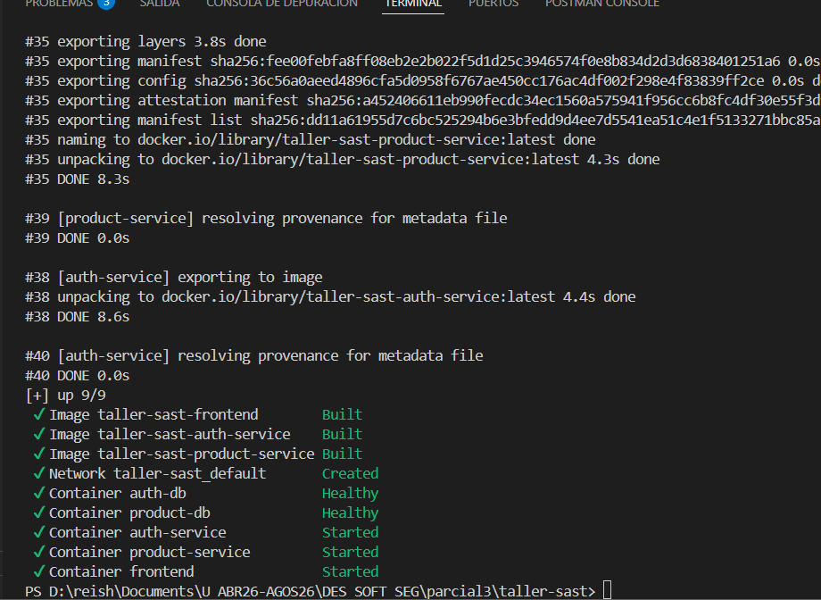
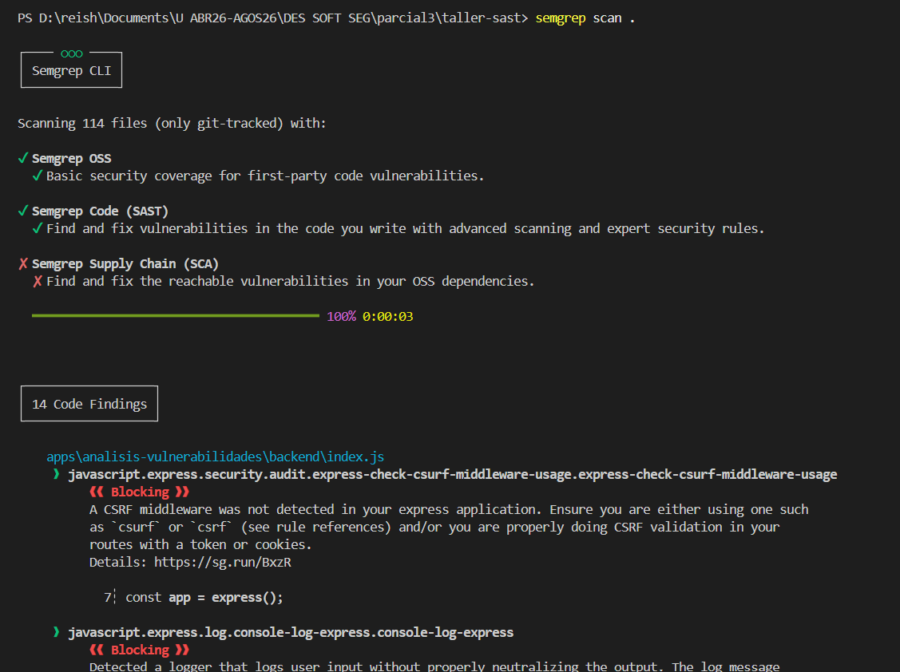
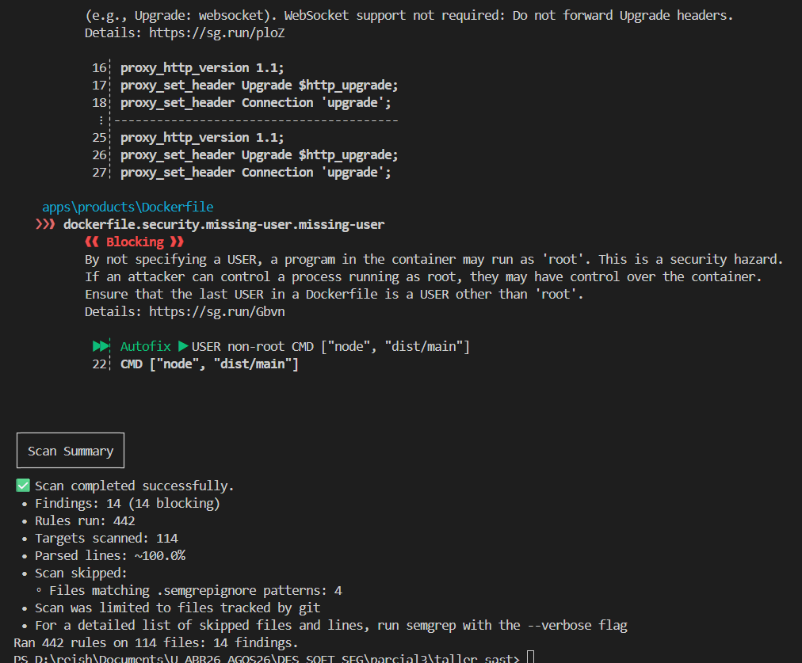
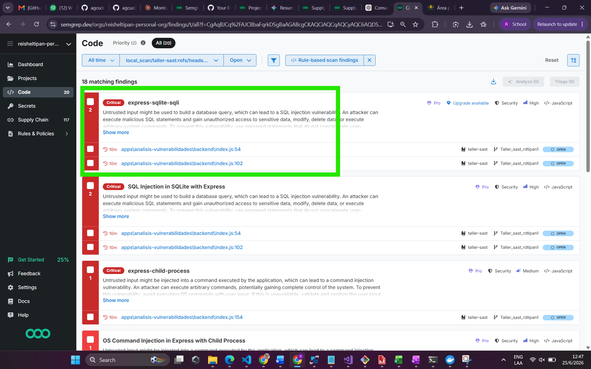
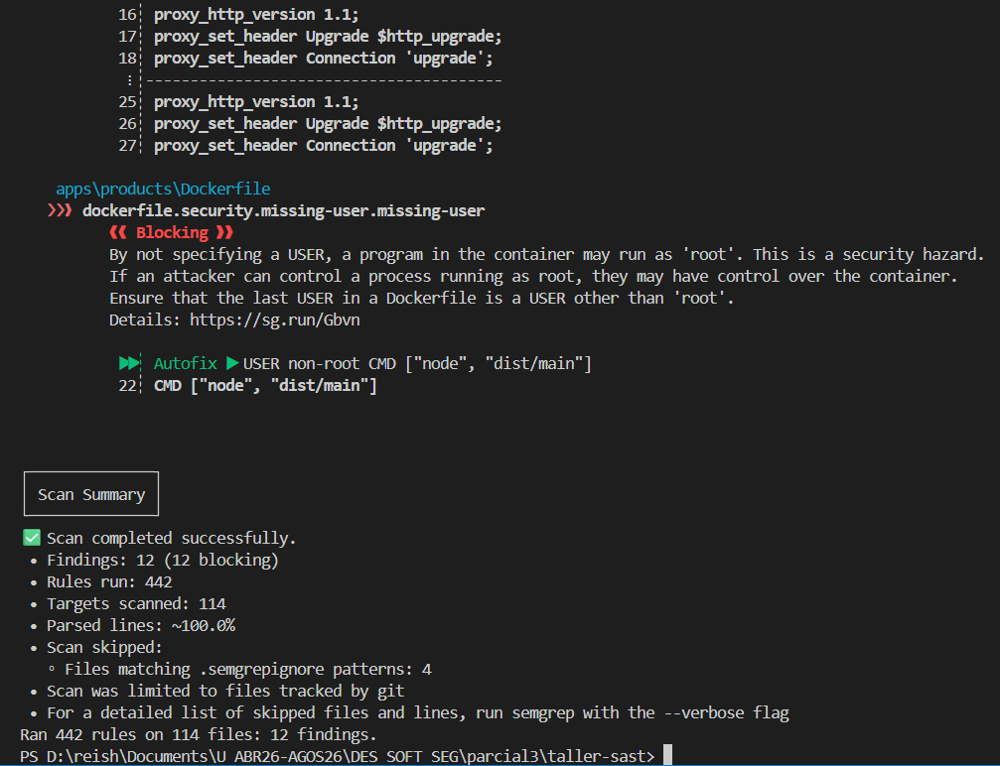
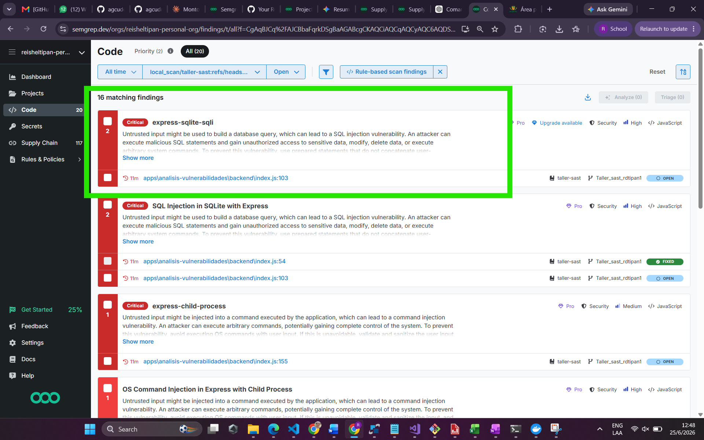
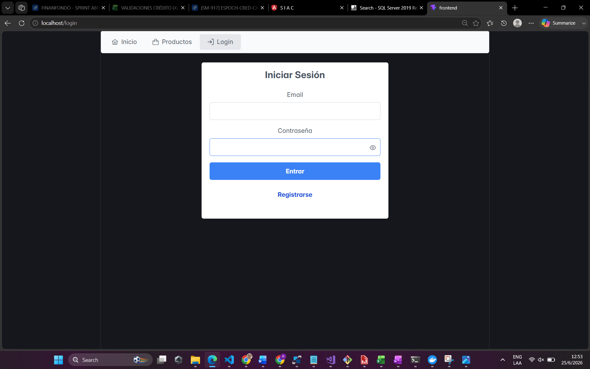

# Taller SAST — Análisis de vulnerabilidades con Semgrep

**Estudiante:** Reishel Dayelin Tipán Ávila
**Rama:** `Taller_sast_rdtipan1`
**Herramienta:** Semgrep (OSS + Code SAST)
**Proyecto:** `taller-sast`

---

## 1. Levantamiento del entorno

Lo primero fue levantar el proyecto con Docker Compose. El compose define tres servicios de aplicación (`auth-service`, `product-service` y `frontend`) más dos bases de datos PostgreSQL.

Durante el levantamiento aparecieron algunos errores que tocó resolver antes de poder analizar el código:

- La ruta del servicio de productos en el `docker-compose.yml` apuntaba a una carpeta que no existía (`apps/product-service`), cuando la carpeta real es `apps/products`.
- El build del frontend fallaba en `npm run build` porque había un import sin usar (`apiRefresh`) y el `tsconfig` tiene activado `noUnusedLocals`.
- Los contenedores de backend se reiniciaban en bucle con el error `ReferenceError: crypto is not defined`. Esto pasaba porque las imágenes usaban `node:18-alpine`, donde `crypto` no es global. Se actualizaron los Dockerfiles a `node:20-alpine`.

Una vez corregido todo, los 9 contenedores quedan arriba y saludables:



Se ve el `up 9/9` con las imágenes construidas (`Built`), las dos bases de datos en estado `Healthy` y los servicios en `Started`.

---

## 2. Ejecución del análisis SAST

Con el proyecto funcionando, se ejecutó el análisis estático sobre todo el código:

```bash
semgrep scan .
```

Semgrep escaneó 114 archivos (solo los rastreados por git) usando el motor OSS y el de Code (SAST):



Desde el inicio del escaneo ya se reportan **14 Code Findings**. El primero que aparece es la falta de middleware CSRF en la aplicación Express de la carpeta `analisis-vulnerabilidades`.

---

## 3. Resultados iniciales — 14 vulnerabilidades

Al terminar, el resumen confirma **14 hallazgos, todos en estado *blocking***:



```
Findings: 14 (14 blocking)
Rules run: 442
Targets scanned: 114
```

### Detalle de las vulnerabilidades encontradas

| # | Vulnerabilidad | Archivo | Línea | Severidad |
|---|----------------|---------|-------|-----------|
| 1 | Falta de middleware CSRF | `analisis-vulnerabilidades/backend/index.js` | 7 | Media |
| 2 | Log de entrada de usuario sin neutralizar (log injection) | `analisis-vulnerabilidades/backend/index.js` | 53 | Media |
| 3 | **SQL Injection** (búsqueda de categorías) | `analisis-vulnerabilidades/backend/index.js` | 54 | **Alta** |
| 4 | Log de entrada de usuario sin neutralizar (log injection) | `analisis-vulnerabilidades/backend/index.js` | 101 | Media |
| 5 | **SQL Injection** (búsqueda de productos) | `analisis-vulnerabilidades/backend/index.js` | 102 | **Alta** |
| 6 | **Command Injection** vía `exec()` con input del usuario | `analisis-vulnerabilidades/backend/index.js` | 154 | **Alta** |
| 7 | Llamada a `child_process` con argumento `req` | `analisis-vulnerabilidades/backend/index.js` | 154 | **Alta** |
| 8 | Recursos de CDN sin atributo `integrity` (SRI) | `analisis-vulnerabilidades/frontend/index.html` | 8, 100 | Baja |
| 9 | Dockerfile sin `USER` (corre como root) | `auth-service/Dockerfile` | 25 | Baja |
| 10 | Dockerfile sin `USER` (corre como root) | `frontend/Dockerfile` | 23 | Baja |
| 11 | Dockerfile sin `USER` (corre como root) | `products/Dockerfile` | 22 | Baja |
| 12 | Posible H2C smuggling en Nginx | `frontend/nginx.conf` | 16-18, 25-27 | Media |

> La mayoría de los hallazgos están concentrados en la carpeta `analisis-vulnerabilidades`, que es una aplicación deliberadamente insegura incluida para el ejercicio. Los hallazgos de los Dockerfiles y el `nginx.conf` corresponden a los servicios reales del proyecto.

También se revisó el reporte en el panel web de Semgrep Cloud, donde se listan los mismos hallazgos del proyecto `taller-sast`, entre ellos las dos inyecciones SQL:



---

## 4. Corrección aplicada

De todas las vulnerabilidades, se decidió corregir la **SQL Injection de la línea 54** (endpoint `/api/categories/search`), por ser de severidad alta y fácilmente verificable.

### Código vulnerable

El término de búsqueda llegaba directo desde la petición y se concatenaba dentro de la cadena SQL:

```js
const searchTerm = req.query.name || '';
// Concatenación directa -> SQLi
const query = `SELECT * FROM categories WHERE name LIKE '%${searchTerm}%'`;
console.log('[SQLi Categories]', query);
db.all(query, (err, rows) => {
```

Como el valor del usuario se pega tal cual en la consulta, un atacante puede cerrar la comilla y agregar SQL arbitrario.

### Código corregido

La solución es usar una **consulta parametrizada**: la consulta lleva un placeholder `?` y el valor del usuario se pasa aparte como parámetro, de modo que SQLite lo trata siempre como dato y nunca como código SQL.

```js
const searchTerm = req.query.name || '';
// Corregido: consulta parametrizada para prevenir SQL Injection
const query = 'SELECT * FROM categories WHERE name LIKE ?';
console.log('[SQLi Categories]', query);
db.all(query, [`%${searchTerm}%`], (err, rows) => {
```

Esta es la misma técnica que ya usa correctamente el endpoint de creación de categorías en el mismo archivo, así que es consistente con el resto del código.

---

## 5. Verificación de la corrección

Para comprobar que la corrección realmente eliminó la vulnerabilidad, se volvió a ejecutar el análisis:

```bash
semgrep scan .
```

El total bajó de **14 a 12 hallazgos**:



```
Findings: 12 (12 blocking)
```

Se eliminaron **2 hallazgos** asociados a la línea 54: la regla `express-sqlite-sqli` y la regla `sqlite-express`, que apuntaban ambas al mismo `db.all` vulnerable. La inyección de la línea 102 (búsqueda de productos) sigue apareciendo porque no se modificó, lo que confirma que la baja se debe específicamente a la corrección aplicada y no a otra cosa.

En el panel web de Semgrep también se refleja el cambio: la inyección de la línea 54 ya no aparece como hallazgo abierto en el listado de Code.



### Comparación antes / después

| Momento | Comando | Total de hallazgos | SQLi línea 54 |
|---------|---------|--------------------|---------------|
| Antes | `semgrep scan .` | 14 | Presente |
| Después | `semgrep scan .` | 12 | Eliminada |

---

## 6. Conclusión

Semgrep detectó 14 vulnerabilidades en el proyecto, la mayoría concentradas en la aplicación de prueba `analisis-vulnerabilidades`. Se corrigió la inyección SQL del endpoint de búsqueda de categorías reemplazando la concatenación de cadenas por una consulta parametrizada.

La forma de verificar que la corrección funciona fue volver a ejecutar `semgrep scan .`: el hallazgo desapareció del reporte y el total bajó de 14 a 12, lo que demuestra que la vulnerabilidad quedó efectivamente resuelta sin afectar al resto del análisis.

Por último, con la corrección ya aplicada, la aplicación sigue funcionando con normalidad. El frontend carga sin problemas en `localhost` y muestra la pantalla de inicio de sesión, lo que confirma que el cambio no rompió nada del comportamiento:


